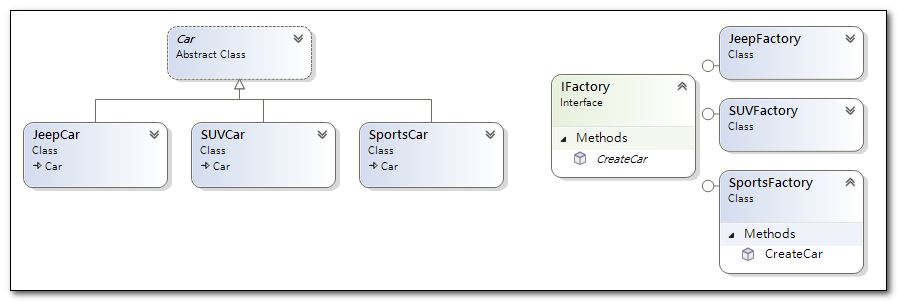

{: .highlight }
>不管哪一種工廠模式，都是用來管理物件創建的模式。

## 簡單工廠模式

{: .note }
>1)又稱為靜態工廠模式，一般來說同一工廠內所產生的類別會有一個共同的父類別或介面。<br>
>2)簡單工廠會依據傳入的參數，回傳不同的物件。使用者取得物件的時候只要傳入正確的參數，不需要去理解這個工廠物件。


```cs
public class Factory
{
	public Car CreateCar(string type)
	{
		return type switch
		{
			"SUV" => new SUVCar(),
			"Jeep" => new JeepCar(),
			"Sports" => new SportsCar(),
			_ => throw new NotImplementedException(),
		};
	}
}
```
```cs
public abstract class Car
{
	protected Car(string type)
	{
		Type = type;
	}

	public string Brand { get; set; } = "";
	public string Type { get; set; } = "";

	public abstract string GetName();
}

public class SUVCar : Car
{
    public SUVCar() : base("SUV")
    {
        Brand = "BMW";
    }

    public override string GetName()
    {
        return $"{this.Brand} {this.Type}";
    }
}

public class JeepCar : Car
{
    public JeepCar() : base("Jeep")
    {
        Brand = "BMW";
    }

    public override string GetName()
    {
        return $"{this.Brand} {this.Type}";
    }
}

public class SportsCar : Car
{
    public SportsCar() : base("Sports")
    {
        Brand = "BMW";
    }

    public override string GetName()
    {
        return $"{this.Brand} {this.Type}";
    }
}
```
```cs
public void Test1()
{
	Factory factory = new Factory();

	var car1 = factory.CreateCar("SUV");
	Debug.WriteLine(car1.GetName());

	var car2 = factory.CreateCar("Jeep");
	Debug.WriteLine(car2.GetName());

	var car3 = factory.CreateCar("Sports");
	Debug.WriteLine(car3.GetName());
}
BMW SUV
BMW Jeep
BMW Sports
```

>缺點：新增產品時，必須修改工廠類別裡面的程式碼，不符合設計模式的（開放/封閉）原則<br>

## 工廠模式

{: .note }
>將簡單工廠的工廠抽象化(改成介面)，只規範要回傳的基底類別。
>實際上要製作的產品則交給具有該介面的實體工廠（Concrete Factory）來實作。



```cs
public interface IFactory
{
	public Car CreateCar();
}

public class SUVFactory : IFactory
{
	public Car CreateCar()
	{
		return new SUVCar();
	}
}

public class JeepFactory : IFactory
{
	public Car CreateCar()
	{
		return new JeepCar();
	}
}

public class SportsFactory : IFactory
{
	public Car CreateCar()
	{
		return new SportsCar();
	}
}
```
```cs
public void Test1()
{
	IFactory suvfactory = new SUVFactory();
	var car1 = suvfactory.CreateCar();
	Debug.WriteLine(car1.GetName());

	IFactory jeepfactory = new JeepFactory();
	var car2 = jeepfactory.CreateCar();
	Debug.WriteLine(car2.GetName());

	IFactory sportsFactory = new SportsFactory();
	var car3 = sportsFactory.CreateCar();
	Debug.WriteLine(car3.GetName());
}
```

>優點：新增產品時，不用修改原有的工廠類別，只要新增實體工廠類別即可。<br>
 缺點：新增產品時，必須不停的新增實體工廠類別，且每個實體工廠類別只能生產一種產品。
 

## 抽象工廠模式

{: .note }
>抽象工廠將一組具有同一主題的單獨工廠封裝起來，但實際上要製作的產品仍交由實體工廠（Concrete Factory）來實作。


```cs
public interface IFactory
{
	public SUVCar CreateSUVCar();

	public JeepCar CreateJeepCar();

	public SportsCar CreateSportsCar();
}

public class CarFactory : IFactory
{
	public SUVCar CreateSUVCar()
	{
		return new SUVCar();
	}

	public JeepCar CreateJeepCar()
	{
		return new JeepCar();
	}

	public SportsCar CreateSportsCar()
	{
		return new SportsCar();
	}
}
```
```cs
public void Test1()
{
	CarFactory carFactory = new CarFactory();

	var car1 = carFactory.CreateSUVCar();
	Debug.WriteLine(car1.GetName());

	var car2 = carFactory.CreateJeepCar();
	Debug.WriteLine(car2.GetName());

	var car3 = carFactory.CreateSportsCar();
	Debug.WriteLine(car3.GetName());
}
```
