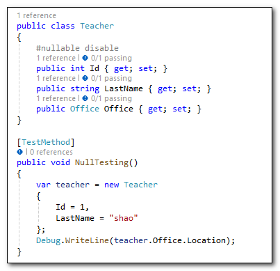
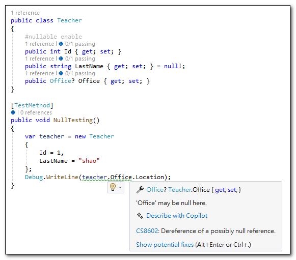
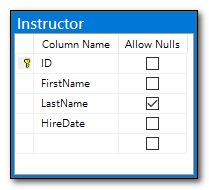
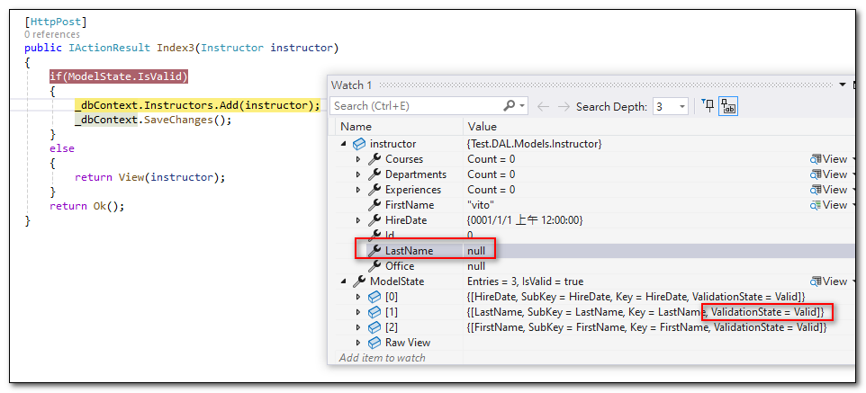
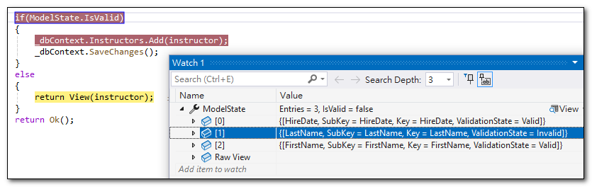
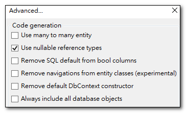
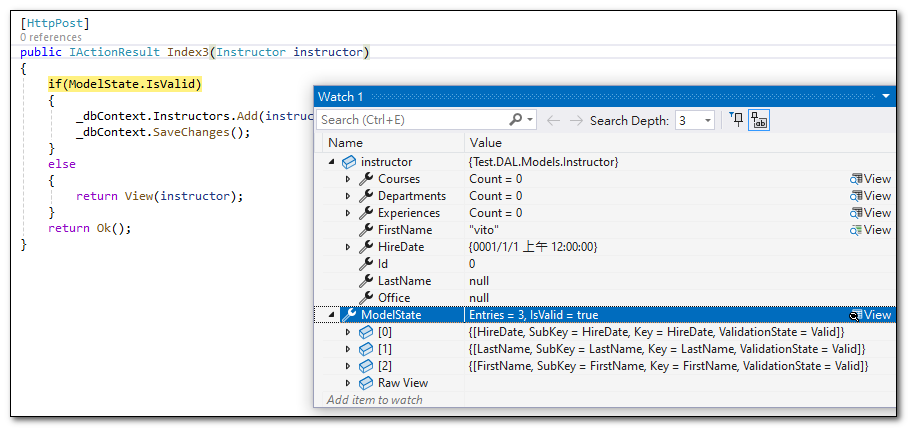

早先，參考型別（reference types）的變數，預設允許 null ？也就是如果沒有給值，其預設值就是 null。這樣的設計，當一個參考型別變數值為 null 時，若直接使用就會導致 NullReferenceException。

為了解決這個問題，C# 8 新導入了「可為 NULL 參考型別」（nullable reference types）的概念，它用來明確定義一個參考型別是否允許 null，幫助開發者在設計階段就發現潛在的 NullReferenceException 問題。

## 未啟用可為 NULL 參考型別

下面這段程式碼，`Office` 屬性是一個參考型別，但沒有初始化，所以預設值是 null。
因為未啟用「可為 NULL 參考型別」，所以在設計階段，編譯器不會檢查是否有可能產生 NullReferenceException。



## 啟用可為 NULL 參考型別

在 C# 8 中，可以透過在檔案的最上方或需要啟用新語法的地方加上 `#nullable enable` 來啟用「可為 NULL 參考型別」。
下面這段程式碼，因為已經啟用「可為 NULL 參考型別」，所以在宣告屬性時，就必須明確標註是否允許 NULL。
這樣的改變，讓編譯器在設計階段，就可以檢查出是否有可能產生 NullReferenceException。




## EF Core 中的 Nullable Reference Types

在 Entity Framework Core 中，若沒有啟用 Nullable Reference Types 功能，當 Entity 型別的屬性沒有標註 `[Required]` 屬性時，EF Core 會將其視為可為 NULL 的屬性，所以執行 Model.IsValid 時，不會檢查這些屬性是否有值。

但是若啟用了 Nullable Reference Types 功能，只要沒有明確標註屬性可為 NULL 的話，EF Core 就會將其視為必填的。

更詳細的說明，可以參考 
- [Entity Framework Core 中的 Nullable Reference Types](https://docs.microsoft.com/en-us/ef/core/miscellaneous/nullable-reference-types)
- [Required and optional properties](https://learn.microsoft.com/en-us/ef/core/modeling/entity-properties?tabs=data-annotations%2Cwithout-nrt#required-and-optional-properties)

---

例如：若資料庫中有個 `Instructor` 資料表，含有四個欄位：`Id`, `FirstName`, `LastName`, `HireDate`，其由只有 `LastName` 欄位允許 NULL。



### 未啟用 Nullable Reference Types 功能
在建立這個 Entity 型別時，若沒有啟用 Nullable Reference Types 功能，EF Core 會將 `LastName` 欄位視為可為 NULL 的屬性，所以執行 Model.IsValid 時，不會檢查這個屬性是否有值，只會檢查標註了 `[Required]` 屬性的屬性是否有值。

```csharp
public partial class Instructor  //Entity 型別
{
    public int Id { get; set; }

    [Required]
    public string FirstName { get; set; }

    public string LastName { get; set; }

    [Required]
    public DateTime HireDate { get; set; }
}
```

- LastName 欄位沒有標註 `[Required]` 屬性，所以 EF Core 會將其視為可為 NULL 的屬性。
- Id 欄位，因屬性名稱為 Id 或 \<type name\>Id 會因自動視為 Entity 的 Key，所以不需要標註 `[Required]` 屬性。

### 啟用 Nullable Reference Types 功能
但是，若啟用了 Nullable Reference Types 功能，只要沒有明確標註屬性可為 NULL 的話，EF Core 就會將其視為必填的屬性。
所以在執行 Model.IsValid 時，也會檢查 LastName 屬性是否有值。


### 啟用 NRT 功能，明確標註可為 NULL 的屬性

使用 EF Core Power Tools 進行反向工程時，若有勾選啟用 Nullable Reference Types 功能，EF Core Power Tools 會自動為 Entity 型別的屬性加上 `!` 或 `?` 符號，來表示是否允許 NULL。



Entity 型別中：
- 型別後面有加上 `?` 符號，才表示允許 NULL。
- 型別後面沒有加上 `?` 符號的話，即使屬性沒有標註 `[Required]` 屬性， EF Core 就會將其視為必填的屬性。

```csharp
public partial class Instructor  //Entity 型別
{
    public int Id { get; set; }

    public string FirstName { get; set; } = null!;

    public string? LastName { get; set; }

    public DateTime HireDate { get; set; }
}
```


啟用 NRT 功能後，不允許 NULL 的屬性，都要給預設值，若沒有給值，編譯器會發出警告。
- 若為實值型別：因為實值型別都有預設值，所以不需要額外給預設值。
- 若為參考型別：可以加上 `!` 符號，表示這個屬性不會是 NULL。或者 new 一個空集合當做預設值。
```csharp
public partial class Person
{
    public int Id { get; set; }

    public string FirstName { get; set; } = null!;

    public virtual ICollection<Person> Children { get; set; } = new List<Person>();

    public virtual ICollection<Person> Parents { get; set; } = []; // [] 等同於 new List<Person>()
}
```