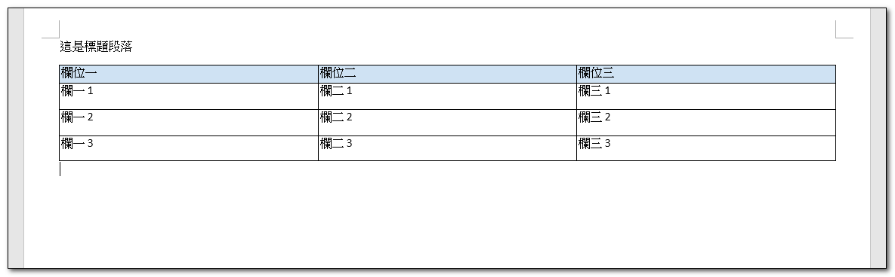
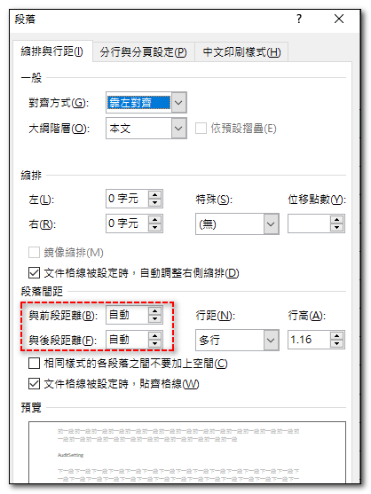

微軟從 Office 2007 開始，將 Open XML 檔案格式改成 Office 預設的檔案格式。

[Open XML SDK](https://github.com/dotnet/Open-XML-SDK) 是微軟提供一個API, 讓開發人員可以在不需要安裝 Microsoft Office 的情況下，用它來讀取和寫入 Office 文件。

## 前置作業
先安裝 NuGet 套件：
```bash
dotnet add package DocumentFormat.OpenXml
```

## 範例程式碼
```csharp
[Test]
public void Sample()
{
    string output = @"D:\\Sample.docx";

    using (WordprocessingDocument wordDoc = WordprocessingDocument.Create(output, WordprocessingDocumentType.Document))
    {
        var doc = new Document();
        var body = new Body();

        // 設定紙張為橫式 & 邊界為窄邊界
        SectionProperties sectionProps = new SectionProperties();

        //設定頁面大小
        PageSize pageSize = new()
        {
            Width = 16838U, // A4 橫向
            Height = 11906U,
            Orient = PageOrientationValues.Landscape
        };

        //設定頁邊距(窄邊界) 1 英寸 = 1440 Twips
        PageMargin pageMargin = new()
        {
            Top = 720,        // 上邊界：0.5 inch
            Right = 720,      // 右邊界：0.5 inch
            Bottom = 720,     // 下邊界：0.5 inch
            Left = 720,       // 左邊界：0.5 inch
            Header = 720,     // 頁首距離：0.5 inch
            Footer = 720,     // 頁尾距離：0.5 inch
            Gutter = 0        // 裝訂線：0
        };

        sectionProps.Append(pageSize, pageMargin);
        body.Append(sectionProps);

        // 插入一個段落
        var paragraph = new Paragraph(new Run(new Text("這是標題段落")));

        // 設定段落屬性 - 段前段後 spacing
        ParagraphProperties paragraphProperties = new();
        SpacingBetweenLines spacingBetweenLines = new()
        {
            BeforeAutoSpacing = true, // 自動段前間距
            AfterAutoSpacing = true, // 自動段後間距
            LineRule = LineSpacingRuleValues.Auto
        };
        paragraphProperties.Append(spacingBetweenLines);
        paragraph.AppendChild(paragraphProperties);
        body.AppendChild(paragraph);

        // 插入一個表格
        Table table = new();

        // 設定表格樣式
        TableProperties tableProperties = new TableProperties();
        TableBorders borders = new TableBorders
        {
            TopBorder = new TopBorder { Val = BorderValues.Single }, // 上邊框
            BottomBorder = new BottomBorder { Val = BorderValues.Single }, // 下邊框
            LeftBorder = new LeftBorder { Val = BorderValues.Single }, // 左邊框
            RightBorder = new RightBorder { Val = BorderValues.Single }, // 右邊框
            InsideHorizontalBorder = new InsideHorizontalBorder { Val = BorderValues.Single }, // 內部水平邊框
            InsideVerticalBorder = new InsideVerticalBorder { Val = BorderValues.Single }, // 內部垂直邊框
        };
        TableWidth tableWidth = new() { Width = "5000", Type = TableWidthUnitValues.Pct };
        TableStyle tableStyle = new() { Val = "TableGrid" };
        tableProperties.Append(borders, tableWidth, tableStyle);

        table.AppendChild(tableProperties);

        // 建立表格標題列
        string[] captions = ["欄位一", "欄位二", "欄位三"];
        var th = new TableRow();
        foreach (var caption in captions)
        {
            var tc = new TableCell();

            // 定義一個段落
            Paragraph cellParagraph = new ();                   

            // 設定段落與前後段的間距 spacing
            ParagraphProperties cellParagraphProperties = new();
            SpacingBetweenLines cellSpacing = new()
            {
                BeforeAutoSpacing = true,   // 與前段間距(自動)
                AfterAutoSpacing = true,    // 與後段間距
                LineRule = LineSpacingRuleValues.Auto
            };
            cellParagraphProperties.AppendChild(cellSpacing);
            cellParagraph.AppendChild(cellParagraphProperties);

            cellParagraph.AppendChild(new Run(new Text(caption)));

            // 設定儲存格屬性 - 背景顏色
            var cellProperty = new TableCellProperties();
            var shading = new Shading()
            {
                Color = "auto",          // 文字颜色
                Fill = "cfe2f3",         // 背景颜色
                Val = ShadingPatternValues.Clear
            };
            cellProperty.Append(shading);

            tc.Append(cellParagraph, cellProperty);

            th.Append(tc);
        }
        table.AppendChild(th);

        // 建立表格資料列
        for (int i = 0; i < 3; i++)
        {
            TableRow tr = new TableRow();
            tr.Append(
                CreateCell($"欄一 {i + 1}"),
                CreateCell($"欄二 {i + 1}"),
                CreateCell($"欄三 {i + 1}")
            );
            table.Append(tr);
        }

        body.AppendChild(table);

        doc.AppendChild(body);
        wordDoc.AddMainDocumentPart().Document = doc;
    }
}

// 建立一般儲存格的輔助方法
private TableCell CreateCell(string text)
{
    return new TableCell(
        new TableCellProperties(
            new TableCellWidth() { Type = TableWidthUnitValues.Dxa, Width = "2400" }
        ),
        new Paragraph(new Run(new Text(text)))
    );
}
```




## 參考資料
- <a target="_blank" href="">XXXXXXXX</a>
- <a target="_blank" href="">XXXXXXXX</a>
- <a target="_blank" href="">XXXXXXXX</a>
- <a target="_blank" href="">XXXXXXXX</a>