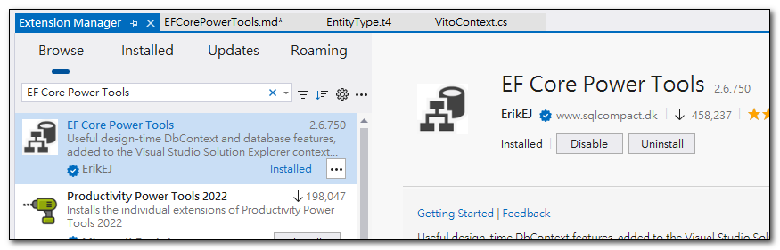
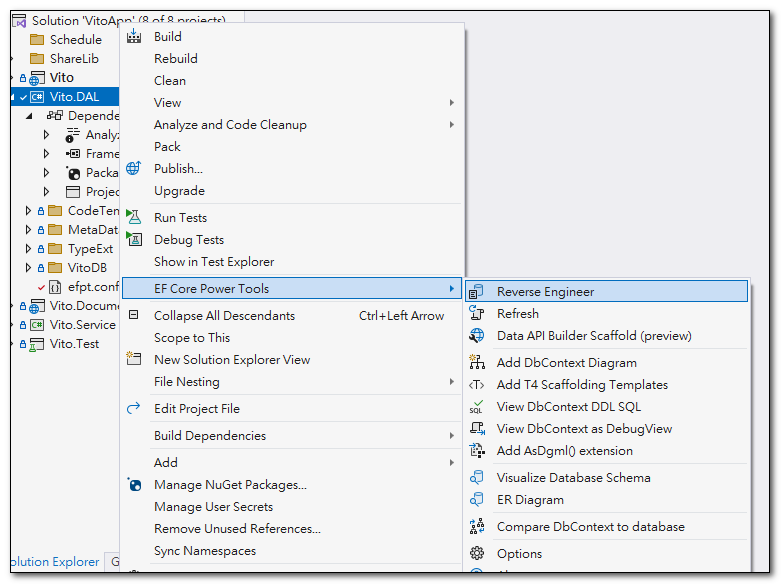
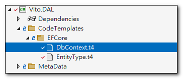
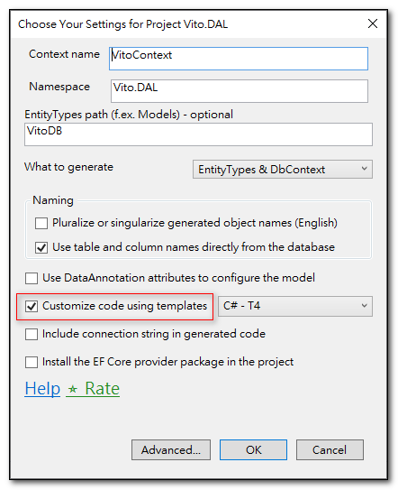

{: .highlight }
>EF Core Power Tools 是一個 Visual Studo 的擴充套件，它提供 GUI 畫面，用來建立資料庫模型。

## 安裝 EF Core Power Tools

在「擴充功能」管理視窗中，搜尋「EF Core Power Tools」，並下載安裝。


## 使用 EF Core Power Tools 進行反向工程

安裝完成後, 
在專案選單中，透過 Reverse Engineer 的功能，就可以輕易產出 DBContext 與 EntityType 的資料庫模型。


## 自訂反向工程範本

反向工程會依據常見的程式碼慣例建立資料庫模型，若想要客製化其輸出的內容，就必須提供生成範本給反向工程參考。

### 產生預設範本

如果要由零開始建立反向工程範本，基本上不太可能，比較簡便的方法是先產生預設的範本，然後再對預設範本進行修改。
```
#安裝 EFCore 範本套件
dotnet new install Microsoft.EntityFrameworkCore.Templates

#建立 EF Template
dotnet new ef-templates
```
在專案目錄中，開啟命令視窗，執行以上指令，執行完成後，會在 `~/CodeTemplate/EFCore` 目錄下產生 EF Core 的範本。
資料夾內有 DbContext.t4 與 EntityType.t4 兩個檔案，分別是對應到 DBContext 與 Entity Type 的生成範本。<br>


### 修改預設範本

依照需求修改 DbContext.t4 與 EntityType.t4 檔案內容，然後再重新進行反向工程。

### 重新進行反向工程

重新進行反向工程時，勾選「Customize code using template」， Reverse Engineer 就會依照修改過的範本進行產出。
