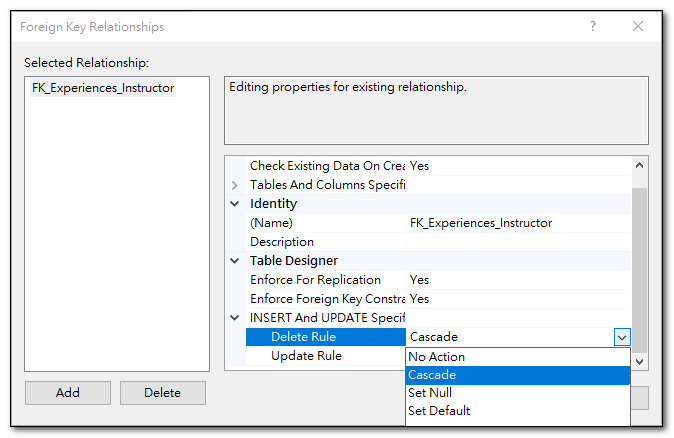
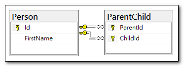
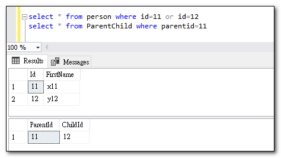

## 什麼是 Cascade

Cascade 是一種資料庫操作的串聯行為，當我們更新或刪除父資料表中的對應資料列時，也會更新或刪除參考資料表中與父資料相關聯的資料列。 
這個功能，可以在 ForeignKey 的設定頁中，將刪除規則設定 Cascade ，這樣當我們刪除主鍵資料時，外鍵資料也會同時自動被刪除。

在 SSMS 中，我們可以透過設定外鍵的刪除規則，來達到 Cascade 的效果。



或者透過 SQL 語法，來設定外鍵的刪除規則。
```sql
ALTER TABLE [dbo].[Experiences]  WITH CHECK ADD  CONSTRAINT [FK_Experiences_Instructor] FOREIGN KEY([InstructorID])
REFERENCES [dbo].[Instructor] ([ID])
ON DELETE CASCADE
```

## EF Core Cascade Delete
EF Core 有支援 Cascade Delete，也就是即使資料庫的外鍵刪除規則沒有設定成 `Cascade`，也可以透過 EF Core 的 Cascade Delete 功能，達到同樣效果。
要做到 Cascade Delete 功能，可以透過 Fluent API 來設定。
```csharp
protected override void OnModelCreating(ModelBuilder modelBuilder)
{
    ...
    entity.HasOne(d => d.Instructor).WithMany(p => p.Experiences)
        .HasForeignKey(d => d.InstructorId)
        .OnDelete(DeleteBehavior.ClientCascade)
        .HasConstraintName("FK_Experiences_Instructor");
}
```
若使用反向工程建立資料庫模型，相依實體的刪除行為預設值是 `ClientSetNull`，我們可以改成 `ClientCascade` ，再利用以下程式碼，即可達到 Cascade Delete 的效果。
這樣刪除 Instructor 時，連帶的 Experiences 也會同時被刪除。

這裡要注意的是，串聯行為只可以套用至 DbContext 追蹤中的 Entity，所以下方程式碼中，透過 Include 方法，將 Experiences 一併載入，這樣才能達到 Cascade Delete 的效果。
```csharp
Instructor instructor = _dbContext.Instructors
    .Include(x =>x.Experiences)
    .First(x => x.LastName == "vito");

_dbContext.Instructors.Remove(instructor);
_dbContext.SaveChanges();
```

## 自我參考關聯的 Cascade Delete 行為
在一個資料表中，可能會有自我參考關聯，也就是資料表中的某個欄位參考到同一資料表中的另一個欄位。

### 一對多自我參考關聯
這種情況下，不允許設定 Cascade Delete。


### 多對多自我參考關聯
這種情況下，不允許二個 FK 同時設定 Cascade Delete，只允許一個 FK 設定 Cascade Delete。
而且，當 FK 對應到的那筆資料被刪除時，並不會同時刪除參考資料，只會刪除其關連性。



例如下圖中的資料：



1. ### 二個 FK 都沒有設定 Cascade Delete
   此狀況下，當刪除 Id=11 或 Id=12 時，都會因為外部鍵的條件約束而發生錯誤。


2. ### 只有 ParentId 設定 Cascade Delete
   當刪除 Id=11 時，會刪除成功，同時刪除中介表中的關聯資料。<br>
   當刪除 Id=12 時，會因為外部鍵的條件約束而發生錯誤。


3. ### 只有 ChildId 設定 Cascade Delete
   當刪除 Id=11 時，會因為外部鍵的條件約束而發生錯誤。<br>
   當刪除 Id=12 時，會刪除成功，同時刪除中介表中的關聯資料。


[Introduction to relationships](https://learn.microsoft.com/en-us/ef/core/modeling/relationships)
