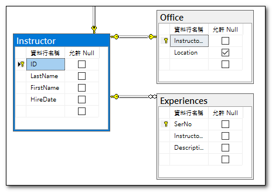
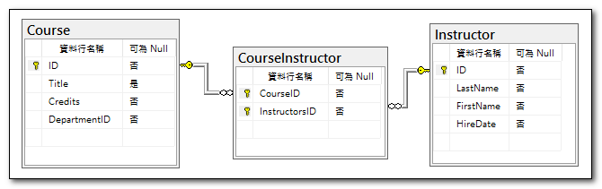

當我們在資料庫的資料表中建立關聯性時，透過 EF Core Power Tools 反向工程建立資料庫模型，它會將關聯性資料，以參考屬性的模式來呈現。
如下圖所示，我們有一個 `Instructor` 實體，它有一個關聯的 Office 和 Expreiences 資料。


在 `Instructor` 實體中，我們可以看到 `Office` 和 `Experiences` 屬性，這兩個屬性是參考到 `Instructor` 實體的外部鍵。
```csharp
// Principal (parent)
public partial class Instructor
{
    public int Id { get; set; }
    public string LastName { get; set; }
    public string FirstName { get; set; }
    public DateTime HireDate { get; set; }
    public virtual ICollection<Experience> Experiences { get; set; } = new List<Experience>();
    public virtual Office? Office { get; set; }
}
// Dependent (child)
public partial class Office
{
    public int InstructorId { get; set; }
    public string? Location { get; set; }
    public virtual Instructor Instructor { get; set; } = null!;
}
// Dependent (child)
public partial class Experience
{
    public int SerNo { get; set; }
    public int InstructorId { get; set; }
    public string Description { get; set; } = null!;
    public virtual Instructor Instructor { get; set; } = null!;
}
```
### 一對多關聯
在上述程式碼中，`Instructor` 與 `Experience` 是「一對多關聯」，`Instructor` 實體有一個 `Experiences` 屬性，它是一個集合，代表一個 `Instructor` 可以有多個 `Experience`。


### 一對一關聯
上述程式碼中，`Instructor` 與 `Office` 是「一對一關聯」，`Instructor` 實體有一個 `Office` 屬性，它是一個 `Office` 實體，代表一個 `Instructor` 只能有一個 `Office`。
反過來看，`Office` 也有一個 `Instructor` 屬性，這稱為雙向關聯性，一個從相依至主體，另一個從主體反轉為相依。

不過，此處的`Instructor`為主體，`Office` 為相依，所以一個`Instructor`物件，沒有必定要存在一個`Office`；但是存在一個`Office`物件，則必定存在一個`Instructor`。

### 多對多關聯
多對多關聯是指兩個實體之間有多個對應關係，例如一個 `Instructor` 可以有多個 `Course`，而一個 `Course` 也可以有多個 `Instructor`。



要建立多對多關聯，我們需要建立一個中介表，例如 `CourseInstructor`，它包含 `InstructorId` 和 `CourseId` 兩個外部鍵，分別參考到 `Instructor` 和 `Course` 實體。
```csharp
public partial class Course
{
    public int Id { get; set; }
    public string? Title { get; set; }
    public int Credits { get; set; }
    public int DepartmentId { get; set; }
    public virtual ICollection<Instructor> Instructors { get; set; } = new List<Instructor>();
}

public partial class Instructor
{
    public int Id { get; set; }
    public string LastName { get; set; }
    public string FirstName { get; set; }
    public DateTime HireDate { get; set; }
    public virtual ICollection<Experience> Experiences { get; set; } = new List<Experience>();
}
```

反向工程不會產生中介表的實體物件，只會在 OnModelCreating 中，建立多對多的關聯性。
下方程式碼示範如何列出某一教師的所有課程，以及如何列出某一課程的所有教師。
```csharp
// 列出某一教師的所有課程
Instructor instructor = _dbContext.Instructors.First();
foreach (var course in instructor.Courses)
{
    Debug.WriteLine(course.Title);
}

// 列出某一課程的所有教師
Course course = _dbContext.Courses.First();
foreach (var instructor in course.Instructors)
{
    .WriteLine(instructor.LastName);
}
```

### 序列化的循環參考問題

因為多對多關聯，二個實體物件會互相參考，當我們要序列化實體物件時，可能會遇到循環參考問題。