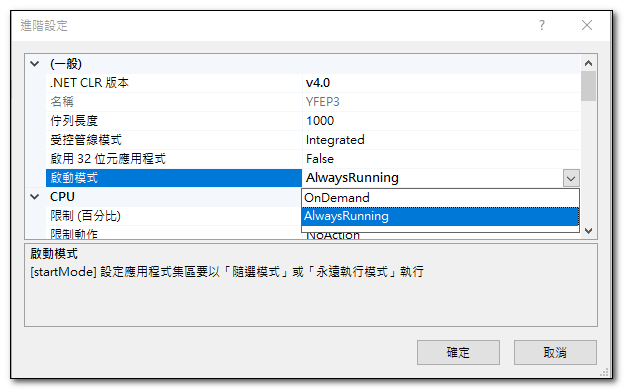
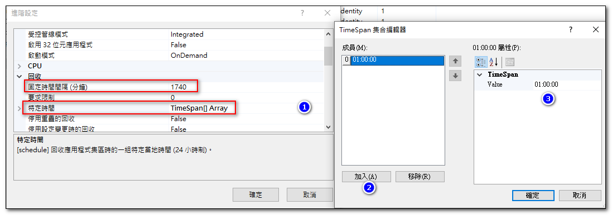
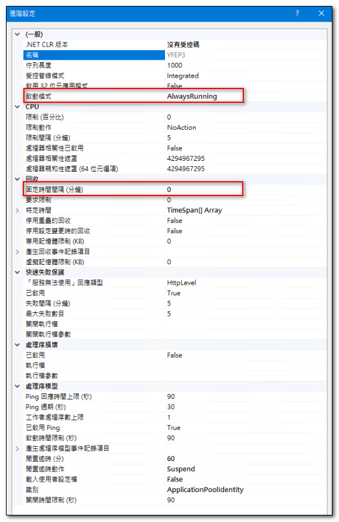
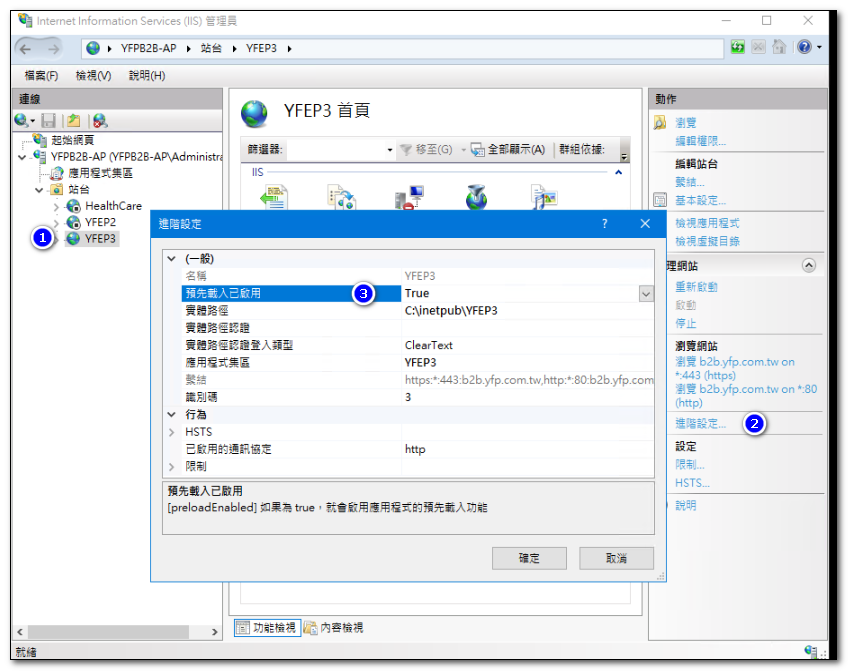
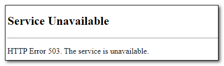
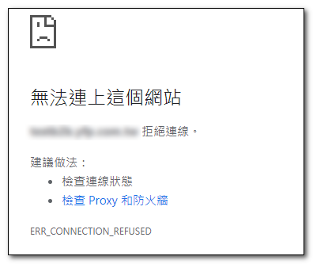

#### 啟動模式
- AlwaysRunning : 永遠保持啟動狀態，不會因為沒有使用者存取而關閉。
- OnDemand：只有當有使用者存取網站時，才會啟動。

固定時間間隔內沒有使用者存取網站，IIS 會將Application Pool關閉，這時再存取網站時會有一段時間的延遲。為了避免這個問題，可以設定應用程式池的 AlwaysRunning 屬性為 True。

#### 固定時間間隔
從IIS6起，Application Pool 就有定期重啟機制，以解決程式跑久可能出現記憶體洩漏(Memory Leaking)的問題。這個屬性預設值為 1740 分, 也就是每隔 29 小時，IIS 會定期啟動回收(Recyling)機制。

- 如果設定為 0, 則表示永遠不啟動回收。
- 可透過「特定時間」的屬性，指定離鋒時間來啟動回收機制。

