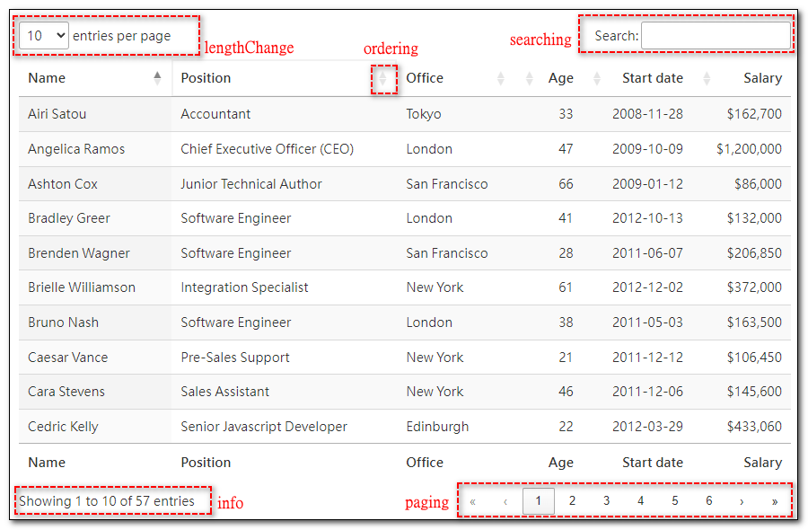

## 相關套件


## 樣式設定

### 初始化設定


```#javascript
var myTable = $("#MyTable").DataTable({
    ordering : true,
    lengthChange: true,
    searching: true,
    info: true,
    paging: true
});
```

```#javascript
myTable = $("#MyTable").DataTable({
    ajax: {
        url: '@Url.Action("GetAnnualRevenue", "Dashboard")',
        type: "POST",
        data: {'companyid':237, 'groupby' : 'm'},
    },
    //ordering : false,        //設定整個Table不使用排序功能
    lengthChange: false,
    searching: false,
    info: false,
    paging: true,

    responsive: true,
    deferRender: true,      //第2頁以後的資料會廷遲載入, 適合大量資料載入, 2.X版預設值為true, 1.X版預設值為false
    destroy: false,

    //凍結設定
    fixedColumns: true,     //設定凍結, 預設標題列和第一欄 (paging必須為true)
    scrollCollapse: true,
    scroller: true,
    scrollY: 200,           //Y捲軸高度200, 超過才顯示Y捲軸

    columns: [
        {
            "sTitle": "年度",
            "mData": "Year",
            "sClass": "text-center", //這個舊式寫法,class只會作用在資料列,標題列沒有效果
        },
        {
            title: "一月",
            data: "M1",
            className: "text-end",  //這個寫法,class同時作用在資料列和標題列
            orderable: false,       //設定這個Column不使用排序功能
            searchable: false,      //這個Column的資料不列入搜尋範圍
            width: 100
        },
        {
            title: '二月',
            data: 'M2',
            className: "text-end",
            render: function (data, type, row) {
                var number = DataTable.render.number(',', '.', 0, '').display(data);
                if (data == null)
                    return '';
                else if (row.M2>=row.M1)
                    return `<span style="color:blue">${number}</span>`;
                else
                    return `<span style="color:green">${number}</span>`;
            }
        },
        {
            title: '三月',
            data: 'M3',
            className: "text-end",
            render: function (data, type, row) {
                var number = DataTable.render.number(',', '.', 0, '').display(data);
                if (data == null)
                    return '';
                else if (data>1000)
                    return `<span style="color:green">${number}</span>`;
                else
                    return `<span style="color:darkgray">${number}</span>`;
            }
        },
        { data: 'M4',   title: '四月',　className: "text-end", render: $.fn.dataTable.render.number(',', '.', 0, '') },
        { data: 'M5',   title: '五月',　className: "text-end", render: $.fn.dataTable.render.number(',', '.', 0, '') },
        { data: 'M6',   title: '六月',　className: "text-end", render: $.fn.dataTable.render.number(',', '.', 0, '') },
        { data: 'M7',   title: '七月',　className: "text-end", render: $.fn.dataTable.render.number(',', '.', 0, '') },
        { data: 'M8',   title: '八月',　className: "text-end", render: $.fn.dataTable.render.number(',', '.', 0, '') },
        { data: 'M9',   title: '九月',　className: "text-end", render: $.fn.dataTable.render.number(',', '.', 0, '') },
        { data: 'M10',  title: '十月',　className: "text-end", render: $.fn.dataTable.render.number(',', '.', 0, '') },
        { data: 'M11',  title: '11月',　className: "text-end", render: $.fn.dataTable.render.number(',', '.', 0, '') },
        { data: 'M12',  title: '12月',　className: "text-end", render: $.fn.dataTable.render.number(',', '.', 0, '') },
        { data:'Total', title: '合計',　className: "text-end", render: $.fn.dataTable.render.number(',', '.', 0, '') },
        {
            title : "功能", data: null,
            render: function (data, type, row) {
                var link = "";
                link += `<button class='btn btnUpdate btn-success btn-xs' type='button'>&nbsp修改</button>`;
                link += `<button class='btn btnDelete btn-danger btn-xs' type='button'>&nbsp刪除</button>`;
                return link;
            }
        }
    ],

    columnDefs: [
        {
            targets: 0,
            width: 100
        },
        {
            targets: 'nosort',
            orderable: false
            // class有nosort欄位, 不排序
            // PS.這個方法只適用HTML中有直接設定標題列,並指定class，若是由 Datatable 產生標題列, 則無效.
        },
        {
            targets: [ 2, 3 ],
            orderable: false   //class有Revenue的欄位, 不排序
        }
    ],

});
```


加入class樣式設定

設定資料型態

設定格式
日期
數值

選取行
            tableProcessFactory.on('click', 'tbody tr', function () {
                if (!$(this).hasClass('selected')) {
                    tableProcessFactory.$('tr.selected').removeClass('selected');
                    $(this).addClass('selected');
                    var rowIndex = $(this).closest('tr');
                    var rowdata = tableProcessFactory.row(rowIndex).data();
                    $("#PFID").val(rowdata.PFID)
                    $(".ProcessName").text(rowdata.ProcessName)
                    ReloadCostAndDays();
                }
            });

## 串接 API 讀取資料


載入完成事件

重新載入資料

            $("#btnQuery").click(function () {
                tableProcessFactory.ajax.reload(function (json) {
                    if (json.data.length > 0) {
                        $('#ProcessFactory tbody tr:eq(0)').click();
                    }
                    else {
                        tableProcessCost.clear().draw();
                        tableProcessDays.clear().draw();
                    }
                });

## Responsive 設定


## 參考資料
- <a target="_blank" href="">XXXXXXXX</a>
- <a target="_blank" href="">XXXXXXXX</a>
- <a target="_blank" href="">XXXXXXXX</a>
- <a target="_blank" href="">XXXXXXXX</a>