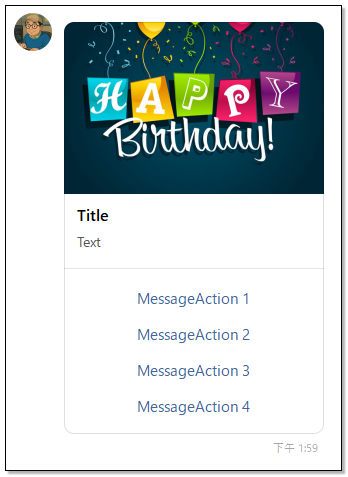
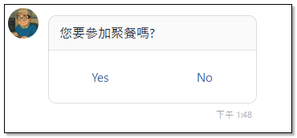
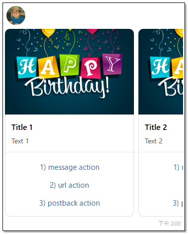
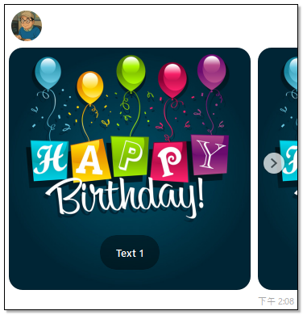
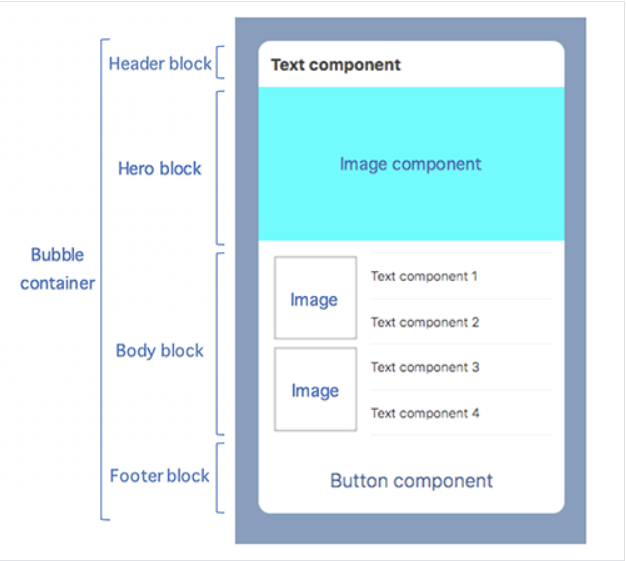

## Message Types
1. [Text message 文字訊息](https://developers.line.biz/en/docs/messaging-api/message-types/#text-message)
1. [Text message(V2) 文字訊息(V2)](https://developers.line.biz/en/docs/messaging-api/message-types/#text-messages-v2)
1. [Sticker message 貼圖訊息](https://developers.line.biz/en/docs/messaging-api/message-types/#messages)
1. [Image message 圖片訊息](https://developers.line.biz/en/docs/messaging-api/message-types/#image-messages)
1. [Imagemap message 圖片地圖訊息](https://developers.line.biz/en/docs/messaging-api/message-types/#imagemap-messages) 
1. [Video message 影片訊息](https://developers.line.biz/en/docs/messaging-api/message-types/#video-messages)
1. [Audio message 音訊訊息](https://developers.line.biz/en/docs/messaging-api/message-types/#audio-message)
1. [Location message 位置訊息](https://developers.line.biz/en/docs/messaging-api/message-types/#location-messages)
1. [Template message 範本訊息](https://developers.line.biz/en/docs/messaging-api/message-types/#template-messages)
	- [Buttons 按鈕](https://developers.line.biz/en/docs/messaging-api/message-types/#buttons-template)
	- [Confirm 確認](https://developers.line.biz/en/docs/messaging-api/message-types/#confirm-template)
	- [Carousel 輪播](https://developers.line.biz/en/docs/messaging-api/message-types/#carousel-template)
	- [Image carousel 圖片輪播](https://developers.line.biz/en/docs/messaging-api/message-types/#image-carousel-template)
1. [Flex Message 彈性訊息](https://developers.line.biz/en/docs/messaging-api/message-types/#flex-messages)

## Action objects
1. [Postback action](https://developers.line.biz/en/reference/messaging-api/#postback-action) Postback 訊息
1. [Message action](https://developers.line.biz/en/reference/messaging-api/#message-action) 發送訊息到聊天視窗上。
1. [URI action](https://developers.line.biz/en/reference/messaging-api/#uri-action) 開啟網址連結
1. [Datetime picker action](https://developers.line.biz/en/reference/messaging-api/#datetime-picker-action) 開啟日期時間選擇器
1. [Camera action](https://developers.line.biz/en/reference/messaging-api/#camera-action) 啟動相機
1. [Camera roll action](https://developers.line.biz/en/reference/messaging-api/#camera-roll-action) 啟動相片選擇器
1. [Location action](https://developers.line.biz/en/reference/messaging-api/#location-action) 啟動位置選擇器
1. [Richmenu Switch Action](https://developers.line.biz/en/reference/messaging-api/#richmenu-switch-action) 切換至指定的 Rich Menu
1. [Clipboard action](https://developers.line.biz/en/reference/messaging-api/#clipboard-action) 複製文字到剪貼簿

## Template message

Template message 共有4種預先定義好的樣式，可以提供較為豐富的內容與使用者互動。

### Buttons Template
這個訊息樣式由4種元素組成：
- 圖片
- 標題：最多40字
- 文字：最多160字
- ActionButton：最多4個

### Confirm Template
這個訊息樣式由2種元素組成：
- 文字：最多240字
- ActionButton：固定2個

### Carousel Template
這個訊息樣式可以想像成由多個 Buttons Template 橫向組成（最多10組）。
- 圖片
- 標題：最多40字
- 文字：若沒有圖片或標題，最多120字，否則最多60字。
- ActionButton：最多3個

### Image Carousel Template
這個訊息樣式類似 Carousel Template，也可以橫向組成（最多10組），但每個訊息只由2種元素組成：
- 圖片：顯示較 Carousel Template 大。
- ActionButton：只能1個

## Flex Message

Flex 訊息是高度客製化的訊息樣式，可以提供更彈性更多元的訊息內容。Flex 訊息有二種樣式：

- Bobble：主要由以下幾個元素組成
	- Box：用於組織和排列其他元件的容器，可以設定版面配置(例如水平、垂直排列)。
	- Button：點擊後可以觸發特定動作的按鈕，例如連結到網頁、撥打電話等。
	- Video：顯示影片的元件。
	- Image：顯示圖片的元件。
		- 只支援HTTPS (TLS 1.2 or later)	  
		- JPEG/PNG
		- MAX : 1024*1024 / 10 MB
	- Icon：顯示文字前方的圖片。
		- 只支援HTTPS (TLS 1.2 or later)	  
		- JPEG/PNG
		- MAX : 1024*1024 / 1 MB
	- Text：顯示文字的元件。
	- Span：顯示指定格式的文字元件，可以調整 粗細 大小 顏色 字型。
	- Separator：在訊息中添加分隔線。
- Carousel：多個 Bubble 橫向組成（最多12組）。

## 參考資料
- <a target="_blank" href="https://developers.line.biz/en/docs/messaging-api/message-types/">Message types</a>
- <a target="_blank" href="https://developers.line.biz/en/reference/messaging-api/#action-objects">Action objects</a>
