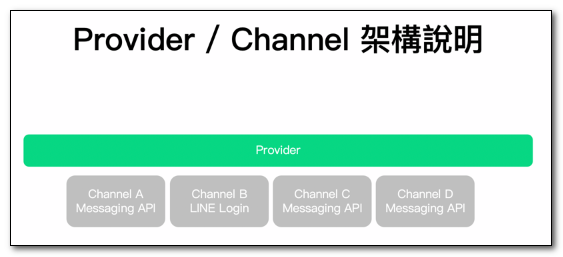
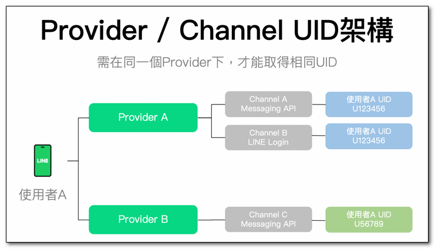
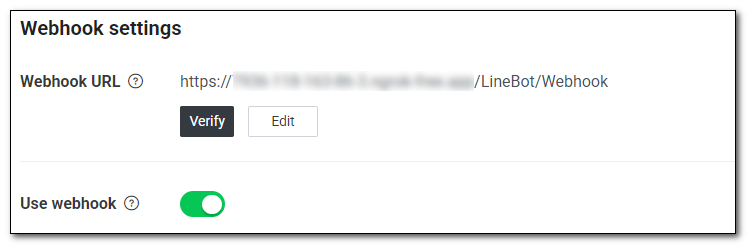
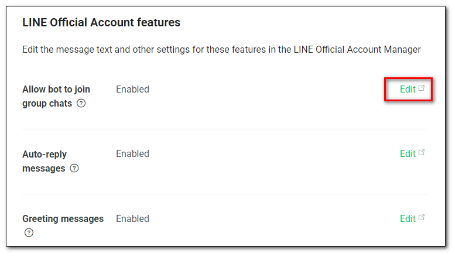
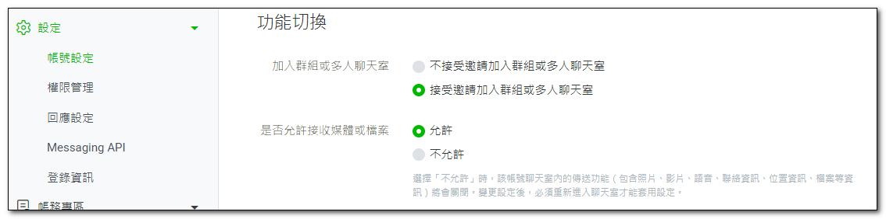

## Privider 與 Channel

- Provider: 在 LINE Developers 網站上，提供服務並獲取用戶資料的單位，可以是個人開發者、公司或組織。
- Channel: LINE 平台所提供的功能，分為 Messaging API 及 LINE Login 等 Channel。一般習慣將這些 Channel 視為一個個的服務項目，例如：客服機器人、官方帳號等。

在每個 Provider 底下，都可以同時設定多組不同的 Messaging API 及 LINE Login Channel，架構圖如下：

## UID

- UID 是使用者與 Provider 之間的唯一識別碼，可以用來識別使用者的身份，並進行個人化的服務
- 當設定完 Provider 及 Channel 後，便可以取得官方帳號好友的UID，以提供更多的個人化服務。
- 同一個使用者，在不同 Provider 的 UID 是不同的，因此同一個商家，若同時經營多個 Channel ，這些 Channel 最好都在同一個 Provider 下，比較容易整合管理。

## Messaging API Channel 設定

申請 Channel 成功後，可以找到 Channel secret 和 Channel access token，WebHook 程式會用到這兩個資訊。
- Channel secret (在 Basic settings 裡)
- Channel access tokent (在 Messaging API 裡)

### Webhook URL

Webhook URL 是用來接收 LINE 平台推送訊息的網址，必須是 HTTPS 協定，且不可包含任何參數。

## LINE 官方帳號功能

- Allow bot to join group chats
  
  允許將LINE Bot（官方帳號）加入社群或群組中。

- Auto-reply messages

  允許機器人自動回覆訊息，通常要實作機器人，所以會關閉此功能。

- Greeting messages

  設置使用者將您的機器人添加為好友時的問候消息。

## 參考資料
- <a target="_blank" href="https://tw.linebiz.com/manual/line-official-account/line-porvider-and-channel-intro/">Provider及Channel設定說明</a>
