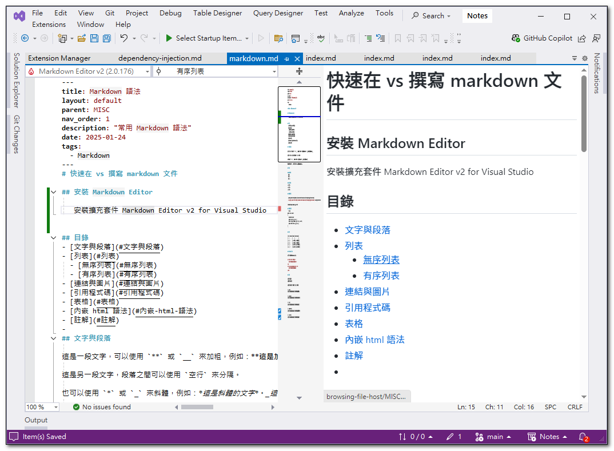

# 快速在 vs 撰寫 markdown 文件

## 安裝 Markdown Editor
   
使用擴充套件 Markdown Editor v2 for Visual Studio，安裝完成之後就可以在 Visual Studio 中撰寫 markdown 文件。


以下是一些常用的 Markdown 語法，本文的 Markdown 內容可在底下連結取得。
[https://github.com/vitoshao/notes/blob/main/docs/MISC/markdown.md](https://github.com/vitoshao/notes/blob/main/docs/MISC/markdown.md)

## 目錄
- [文字與段落](#文字與段落)
- [列表](#列表)
  - [無序列表](#無序列表)
  - [有序列表](#有序列表)
- [連結與圖片](#連結與圖片)
- [引用程式碼](#引用程式碼)
- [表格](#表格)
- [內嵌 html 語法](#內嵌-html-語法)
- [註解](#註解-callout)
- [折疊區塊](#collapsed-section)

## 文字與段落

這是一段文字，可以使用 `**` 或 `__` 來加粗，例如：**這是加粗的文字**。__這也是是加粗的文字__	

這是另一段文字，段落之間可以使用 `空行` 來分隔。

也可以使用 `*` 或 `_` 來斜體，例如：*這是斜體的文字*。_這也是是斜體的文字_

<span class="text-primary">刪除線</span>可以使用 `~~` 來標記，例如：~~這是刪除線的文字~~

## 列表

### 無序清單
- 項目 1
- 項目 2
- 項目 3
  - 項目 3-1 
  - 項目 3-2 

### 有序清單
1. 項目 1
1. 項目 2
1. 項目 3

### 工作清單
- [ ] 項目 1
- [ ] 項目 2
- [x] 項目 3

項目接續

{:style="counter-reset:none"}
1. 項目 4
1. 項目 5

### 定義清單
<dl>
<dt>Name</dt>
<dd>Godzilla</dd>
<dt>Born</dt>
<dd>1952</dd>
<dt>Birthplace</dt>
<dd>Japan</dd>
<dt>Color</dt>
<dd>Green</dd>
</dl>

## 連結與圖片

Markdown 語法建立的連結無法另開新頁籤
- [Loading Related Data](https://learn.microsoft.com/en-us/ef/core/querying/related-data/)
- [Introduction to relationships](https://learn.microsoft.com/en-us/ef/core/modeling/relationships)

若要開新頁籤，只能使用 html 
- <a target="_blank" href="https://learn.microsoft.com/en-us/ef/core/querying/related-data/">Loading Related Data</a>
- <a target="_blank" href="https://learn.microsoft.com/en-us/ef/core/modeling/relationships">Introduction to relationships</a>

Markdown 語法建立的圖片無法更改顯示大小


若要更改顯示大小，只能使用 html

<image src="https://vitoshao.github.io/notes/docs/MISC/images/sample.jpg" width="200" />

## 引用程式碼
```csharp
public class Teacher
{
    #nullable disable
    public int Id { get; set; }
    public string LastName { get; set; } = null!;
    public Office Office { get; set; }
}
```

## 表格

| Id | CourseId | Name | Description |
|----|----------|------|-------------|
| 1  | 1        | C# 基礎 | C# 基礎課程 |
| 2  | 1        | C# 進階 | C# 進階課程 |
| 3  | 2        | SQL 基礎 | SQL 基礎課程 |
| 4  | 2        | SQL 進階 | SQL 進階課程 |

## 內嵌 html 語法

以下是一段簡單的內嵌 html 語法：

<p style="color: darkgray">
    這是一段帶有深灰色樣式的文字。
</p>
<div style="background-color: red">
    這是一段帶有紅色背景的區塊。
</div>

## 註解 (Callout)

### 一般註解

>這是一段註解。
>這還是同一段註解。

>這是另一段註解。使用 `空行` 來分隔不同段落。

### 有樣式的註解

{: .note}
>這是一段有特殊樣式的註解，可以用來`強調重點`。

{: .warning}
>這是一段有特殊樣式的註解，可以用來`警告使用者`。

{: .important}
>這是一段有特殊樣式的註解，可以用來`強調重要性`。

{: .highlight}
>這是一段有特殊樣式的註解，沒有`TITLE`

### 自訂標題的註解

{: .note-title}
>My Note
>
>這是一段有特殊樣式的註解，可以用來`強調重點`。

{: .warning-title}
>My Warning
>
>這是一段有特殊樣式的註解，可以用來`警告使用者`。

{: .important-title}
>My Important
>
>這是一段有特殊樣式的註解，可以用來`強調重要性`。

{: .highlight-title}
>My Heighligh
>
>這是一段有特殊樣式的註解，沒有`TITLE`

## Collapsed Section

使用 [`<details>`](https://docs.github.com/en/get-started/writing-on-github/working-with-advanced-formatting/organizing-information-with-collapsed-sections) 標籤，可以建立折疊區塊。

<details markdown="block">
<summary>Shopping list (click me!)</summary>

This is content inside a `<details>` dropdown.
- [x] Apples
- [ ] Oranges
- [ ] Milk
</details>

## label

Default label
{: .label }

Blue label
{: .label .label-blue }

Stable
{: .label .label-green }

New release
{: .label .label-purple }

Coming soon
{: .label .label-yellow }

Deprecated
{: .label .label-red }

