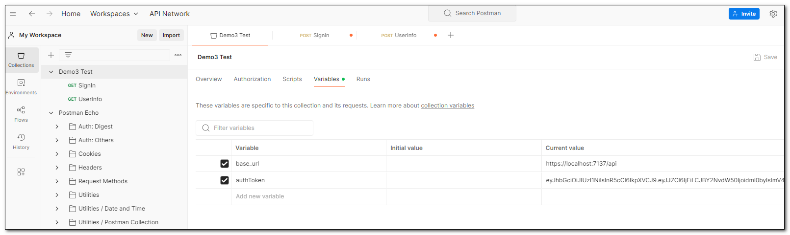
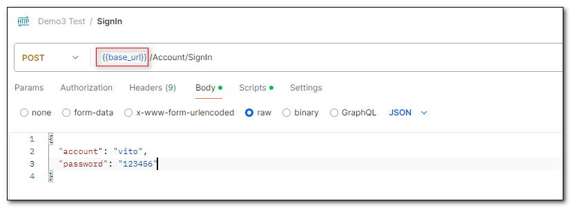
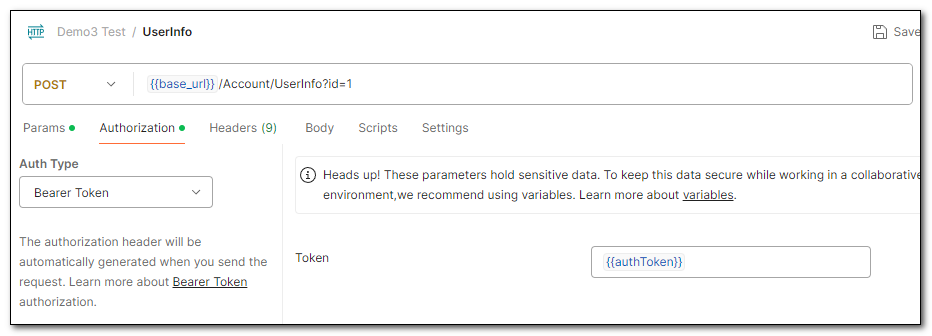

### 定義 Postman 變數

新增一個 Collections，在 Variables 頁面中，定義變數。

在 Request 中使用二個大括號 `{``{``}``}` 引用變數

### 將 Response 內容存成 Postman 變數

在 Request 的 Script 頁面中，使用 Javascript 取得回應內容，再用 `pm.collectionVariables.set` 將內容存成集合變數。

這個 Request 用到二個變數，一個是 `base_url`(自定義)，另一個是 `authToken`（由前一個 Request 回應內容儲存而來）

## 參考資料
- <a target="_blank" href="https://www.youtube.com/watch?v=xBwCgobT6k0&t=27s&ab_channel=ITsLifeOverAll">使用 Postman 進行 API 測試</a>