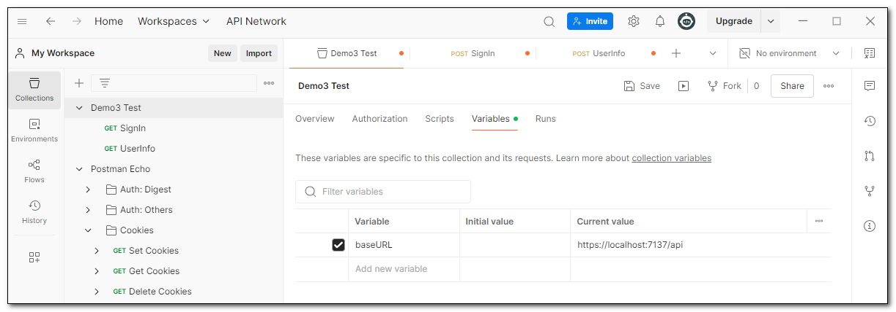
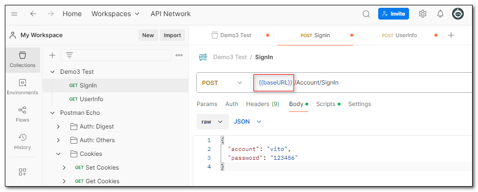
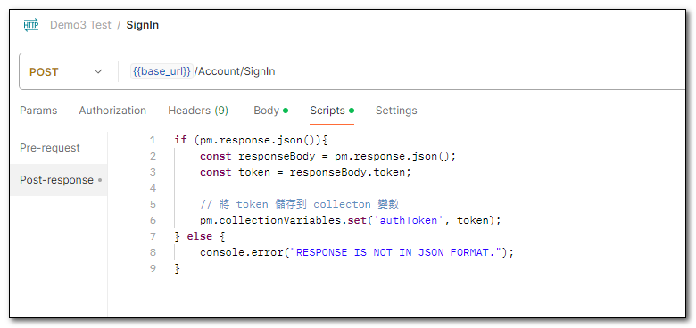
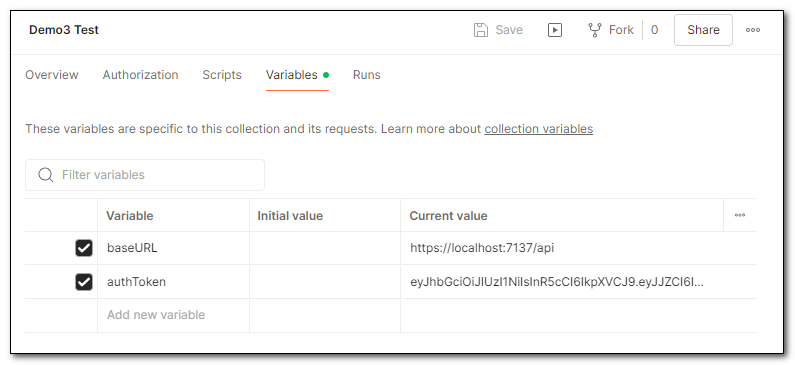
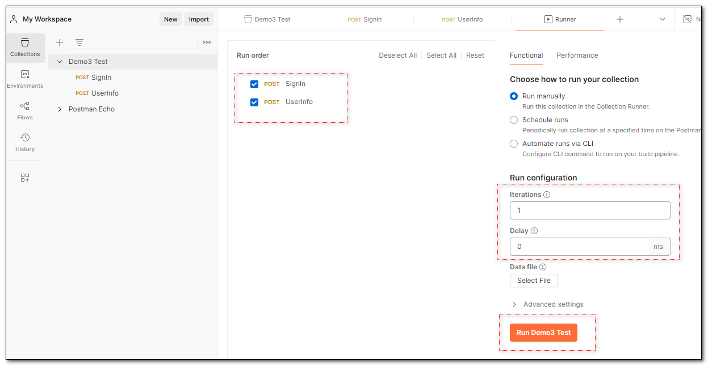
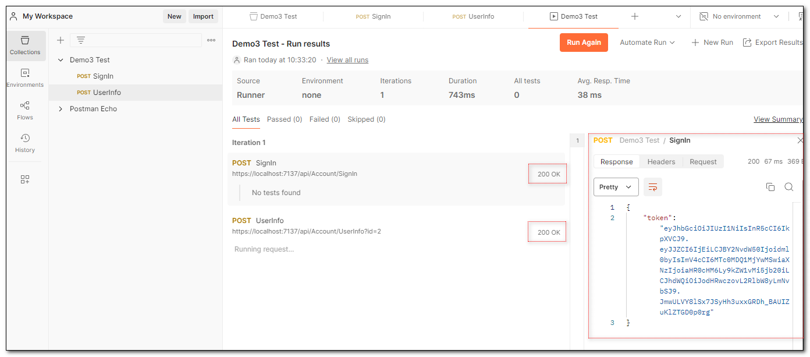

### 定義 Postman 變數

新增一個 Collections，在 Variables 頁面中，定義變數。

在 Request 中，不管是網址或者傳送的參數內容，都可以使用二個大括號 \{\{\}\} 引用變數

### 將 Response 內容存成 Postman 變數

除了自行定義變數外，也可以將 Response 內容存成 Postman 變數。
例如，在 Request 的 Script 頁面中，使用 Javascript 取得回應內容，再透過 `pm.collectionVariables.set` 將內容存成集合變數。

執行後，可以在 Variables 頁面中看到變數已經被設定。

### 設定授權

會設定變數，要處理授權的問題，就輕鬆了。
例如，這個 Request ，我們在 Auth 頁簽中，指定一個 Bearer Token，同時使用`authToken`這個變數，帶入前一個 Request 儲存下來的 Token 內容。

### 連續執行多個 Request

Collection 中的 Request 可以連續執行。

連續執行預設會依序列出所有 Request ，你可以調整執行順序，也可以設定每個 Request 的執行間隔時間。

執行結果會顯示在右邊的視窗中。

## 參考資料
- <a target="_blank" href="https://www.youtube.com/watch?v=xBwCgobT6k0&t=27s&ab_channel=ITsLifeOverAll">使用 Postman 進行 API 測試</a>