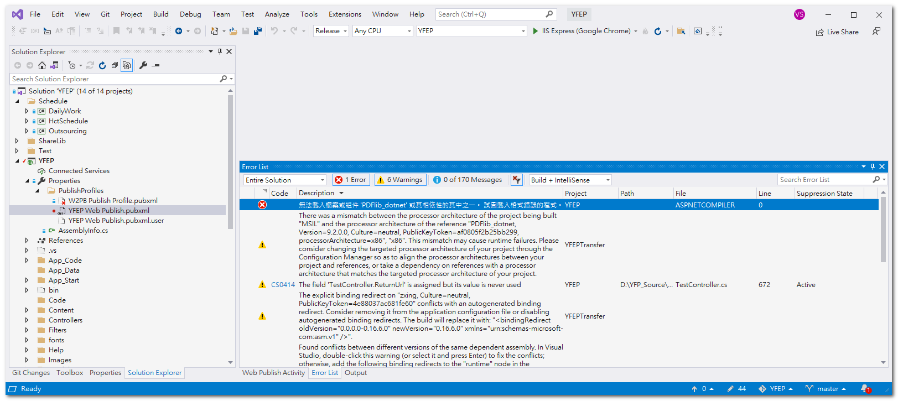

建置或發行專案時，產生以下錯誤「無法載入檔案或組件 'PDFlib_dotnet' 或其相依性的其中之一。 試圖載入格式錯誤的程式。」



這是因為此次使用的PDFlib_dotnet是64bit，所以必須明確指定使用64bit編譯器。

解決方法是在publish profile中加入底下這行設定
```xml
<AspnetCompilerPath>C:\Windows\Microsoft.NET\Framework64\v4.0.30319</AspnetCompilerPath>
```

