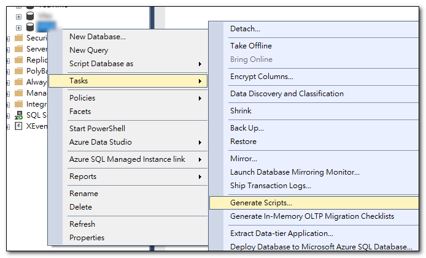
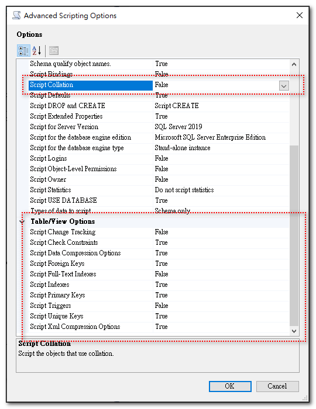
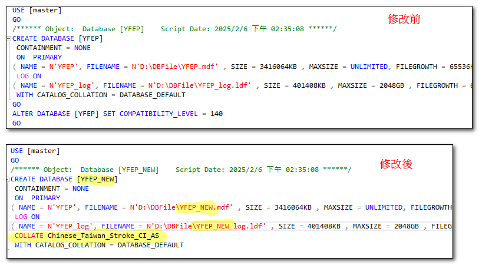
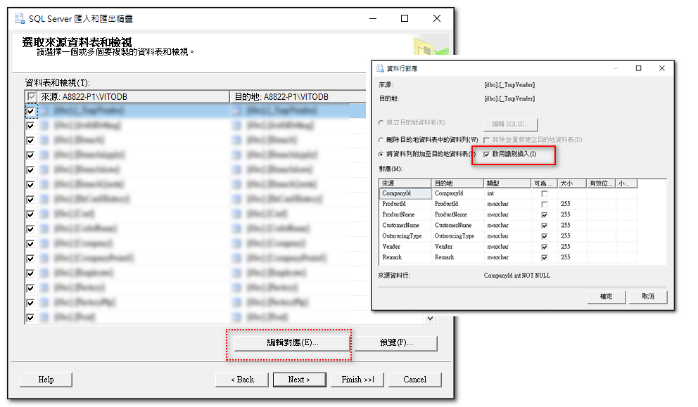
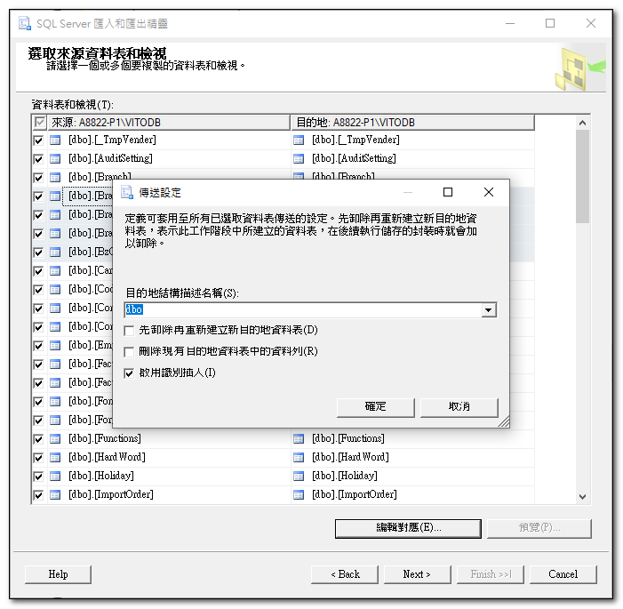
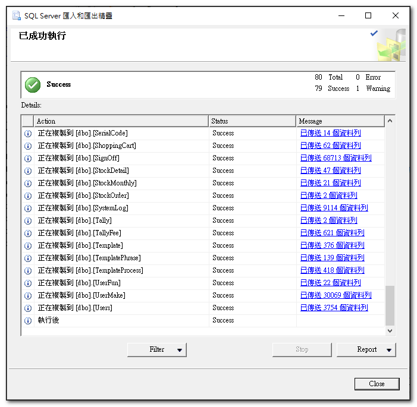

## 前言：什麼是定序？

 定序是一種資料庫的屬性，用來指定資料庫中字串的排序和比較規則。

例如：
- Chinese_Taiwan_Stroke_CI_AS
- Chinese_Taiwan_Stroke_90_CI_AS_SC

Chinese_Taiwan_Stroke：用筆畫進行排序<br>
Chinese_Taiwan_Bopomofo：用ㄅㄆㄇㄈ進行排序。<br>
CI：Case Sensitive<br>
AS：Accent Sensitive<br>
SC：增補字集<br>
90：資料庫版本<br>

有些定序和資料庫版本有關，例如含有90的定序就是SQL Server 2005的定序。<br>

SC定序是 SQL Server 2012 （11.x）新引進的與增補字集有關的定序。從 SQL Server 2017 (14.x) 開始，所有新的定序都會自動支援增補字元。


## 如何變更定序

{: .note}
>定序設定可分成伺服器層級、資料庫層級、資料行層級。
>雖然每個層級的定序都可以變更，但對原本已經建立好的資料，變更上層層級的定序，並不會改變原先下層層級的定序。

### 1. 變更資料庫的定序
```sql
-- 設定為單一使用者
ALTER DATABASE [SchoolDB] SET SINGLE_USER;
GO

-- 變更資料庫定序
ALTER DATABASE [SchoolDB] COLLATE Chinese_Taiwan_Stroke_CS_AS
GO

-- 恢復成為多人使用
ALTER DATABASE [SchoolDB] SET MULTI_USER;
GO
```

### 2. 變更資料行(欄位)的定序
```sql
ALTER TABLE Student ALTER COLUMN FirstName nvarchar(50) COLLATE Chinese_Taiwan_Stroke_CS_AS
```

{: .highlight}
>雖然欄位的定序可以變更，但 MSDN 上有寫，如果欄位參考了下列任何一個項目的定序，就無法變更其定序：
>- 計算資料行
>- 索引
>- 散發統計資料，不論是自動產生或由 CREATE STATISTICS 陳述式產生
>- CHECK 條件約束
>- FOREIGN KEY 條件約束

## 如何改變整個資料庫的定序

一個已經運行中的資料庫，資料欄位很容易遇到以上不可變更的狀況。底下是一個方法，示範如何將一個資料庫的定序由 Chinese_Taiwan_Stroke_90_CI_AS_SC 變更成 Chinese_Taiwan_Stroke_CI_AS，包含所有文字型態欄位。

### 1. 由原始資料庫，產出資料庫建立的完整腳本

使用 SSMS 建立整個資料庫完整腳本，但不含資料，這樣就可以得到一個包含所有資料表、索引、條件約束、預存程序、檢視等等的腳本。這個腳本可以用來建立一個和原始資料庫一樣結構的新資料庫。



使用 SSMS 建立腳本時，進階選項中的有幾個要注意的事項：
1. General<br>
Script Collaton：要設定為 False (預設值就為 Fase)<br>
設成 False，就不會在腳本中產生定序的相關設定，在底下步驟中，我們會再調整腳本，以便建立新的資料庫時，使用我們要的資料庫定序。

2. Table/View Optionsl

這裡面的選項，可依實際狀況進行調整，例：

- Full-Text Indexes：預設值為 Fase，若有用到就改為 True。
- Trigger：預設值就為 Fase，若有用到就改為 True。
- Indexes：預設值就為 True，應該都有用到，就用預設值。



### 2. 使用腳本建立新的資料庫

將上一個步驟中的腳本，依實際需要進行修改，例如：

1. 修改資料庫名稱及資料庫的檔案名稱及位置
2. 指定資料庫定序

建立腳本時，我們沒有指定定序，所以調整腳本，依我們要的定序建立新的資料庫。


   
### 3. 使用 Export/Import 功能，將原始資料庫中的資料複製到新的資料庫。

直接使用匯出/匯入操作時，通常會遇到幾個問題:

1. FOREIGN KEY 條件約束(CONSTRAINT)
2. Identity 欄位值無法匯入

可以透過下列方式解決：

停用全部資料庫內的 FOREIGN KEY 條件約束
{: .label }

下面語法，可以停用/啟用資料庫內的 FOREIGN KEY 條件約束(CONSTRAINT)、CHECK 條件約束(CONSTRAINT)
```sql
-- 全部停用：資料庫內的 FOREIGN KEY 條件約束(CONSTRAINT)、CHECK 條件約束(CONSTRAINT)
USE YFEP_New
GO
EXEC sp_MSforeachtable @command1="ALTER TABLE ? NOCHECK CONSTRAINT ALL"
GO

-- 全部啟用：資料庫內的 FOREIGN KEY 條件約束(CONSTRAINT)、CHECK 條件約束(CONSTRAINT)
-- 不檢查現有資料
USE YFEP_New
GO
EXEC sp_MSforeachtable @command1="ALTER TABLE ? WITH NOCHECK CHECK CONSTRAINT ALL"
GO
```

啟用識別插入
{: .label }

在匯出/匯入的編輯對應功能中，可以選擇「啟用識別插入」(Enable identity insert)，這樣在匯入資料時，就可以保留原始資料庫中的識別值。



也可以同時選取多個資料表，一次設定啟用識別插入



資料複製完成之後，記得啟用 FOREIGN KEY 條件約束。

在我的情況下，做完上述步驟，就可以成功將原始資料庫的資料匯出/匯入到新的資料庫中，這樣就得到一個和原先一樣內容的資料庫，但定序已經變成新的定序。



轉完之後，記得將原始資料庫改名，並將新的資料庫改回原始資料庫的名稱。
```sql
ALTER DATABASE DEMO SET SINGLE_USER WITH NO_WAIT
GO
ALTER DATABASE DEMO_NEW SET SINGLE_USER WITH NO_WAIT
GO

EXEC sp_renamedb 'DEMO' , 'DEMO_OLD' ;
GO

EXEC sp_renamedb 'DEMO_NEW' , 'DEMO' ;
GO

ALTER DATABASE DEMO_OLD SET MULTI_USER WITH NO_WAIT
GO
ALTER DATABASE DEMO SET MULTI_USER WITH NO_WAIT
GO
```