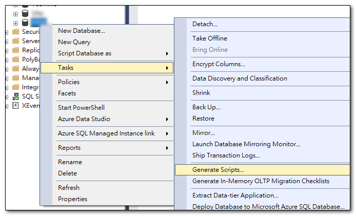
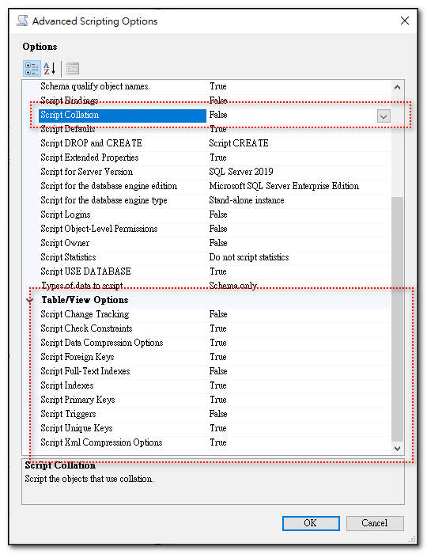
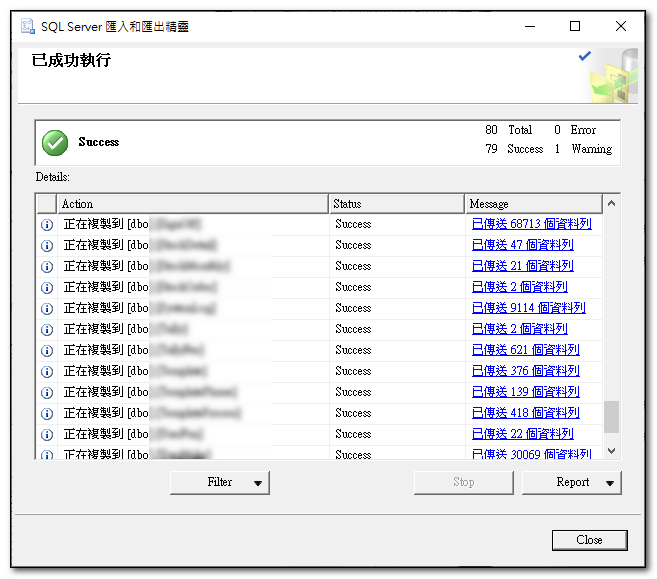

## 前言：什麼是定序？

 定序是一種資料庫的屬性，用來指定資料庫中字串的排序和比較規則。

例如：
- Chinese_Taiwan_Stroke_CI_AS
- Chinese_Taiwan_Stroke_90_CI_AS_SC

Chinese_Taiwan_Stroke：用筆畫進行排序<br>
Chinese_Taiwan_Bopomofo：用ㄅㄆㄇㄈ進行排序。<br>
CI：Case Sensitive<br>
AS：Accent Sensitive<br>
SC：增補字集<br>
90：資料庫版本<br>

有些定序和資料庫版本有關，例如含有90的定序就是SQL Server 2005的定序。<br>

SC定序是 SQL Server 2012 （11.x）新引進的與增補字集有關的定序。從 SQL Server 2017 (14.x) 開始，所有新的定序都會自動支援增補字元。


## 如何變更定序

{: .note}
>定序設定可分成伺服器層級、資料庫層級、資料行層級。
>雖然每個層級的定序都可以變更，但對原本已經建立好的資料，變更上層層級的定序，並不會改變原先下層層級的定序。

### 1. 變更資料庫的定序
```sql
-- 設定為單一使用者
ALTER DATABASE [SchoolDB] SET SINGLE_USER;
GO

-- 變更資料庫定序
ALTER DATABASE [SchoolDB] COLLATE Chinese_Taiwan_Stroke_CS_AS
GO

-- 恢復成為多人使用
ALTER DATABASE [SchoolDB] SET MULTI_USER;
GO
```

### 2. 變更資料行(欄位)的定序
```sql
ALTER TABLE Student ALTER COLUMN FirstName nvarchar(50) COLLATE Chinese_Taiwan_Stroke_CS_AS
```

{: .highlight}
>雖然欄位的定序可以變更，但 MSDN 上有寫，如果欄位參考了下列任何一個項目的定序，就無法變更其定序：
>- 計算資料行
>- 索引
>- 散發統計資料，不論是自動產生或由 CREATE STATISTICS 陳述式產生
>- CHECK 條件約束
>- FOREIGN KEY 條件約束

## 如何改變整個資料庫的定序

一個已經運行中的資料庫，變更資料庫的定序，並不會同時更改所有資料欄位的定序。
而更改資料欄位的定序，又很容易遇到以上不可變更的狀況。底下是一個方法，示範如何將一個資料庫的定序由 Chinese_Taiwan_Stroke_90_CI_AS_SC 變更成 Chinese_Taiwan_Stroke_CI_AS，包含所有文字型態欄位。

### 1. 由原始資料庫，產出資料庫建立的完整腳本

使用 SSMS 建立整個資料庫的完整腳本，但不含資料，這樣就可以得到一個包含所有資料表、索引、條件約束、預存程序、檢視等等的腳本。這個腳本可以用來建立一個和原始資料庫一樣結構的新資料庫。



在設定 SSMS 建立腳本的步驟中，進階選項內有幾個選項要注意：
1. General<br>
Script Collaton：要設定為 False (預設值就為 Fase)<br>
設成 False，就不會在腳本中產生定序的相關設定，在底下步驟中，我們會微調腳本內容，以便建立新的資料庫時，使用我們要的資料庫定序。

2. Table/View Optionsl

這裡面的選項，可依實際狀況進行調整，例：

- Full-Text Indexes：預設值為 Fase，若有用到就改為 True。
- Trigger：預設值就為 Fase，若有用到就改為 True。
- Indexes：預設值就為 True，應該都有用到，就用預設值。



### 2. 使用腳本建立新的資料庫

將上一個步驟中產出的資料庫腳本，依實際需要進行修改，例如：

1. 修改資料庫名稱及資料庫的檔案名稱及位置
2. 指定資料庫定序

因為前面在建立腳本時，我們設定不出輸定序資訊，所以此時將要使用的定序調整至腳本中。


   
調整完之後，執行腳本，就可以得到一個新的資料庫，這個資料庫和原始資料庫一樣的結構，但定序已經變成新的定序。

### 3. 使用 Export/Import 功能，將原始資料庫中的資料複製到新的資料庫。

接下來在 SSMS 中使用「匯出/匯入」功能，將舊有資料庫的資料，全部匯入新的資料庫，不過這個操作，通常會遇到幾個問題:

1. FOREIGN KEY 條件約束(CONSTRAINT)
2. Identity 欄位值無法匯入

這二個問題，可以透過下列方式解決：

停用全部資料庫內的 FOREIGN KEY 條件約束
{: .label }

下面語法，可以停用/啟用資料庫內的 FOREIGN KEY 條件約束(CONSTRAINT)、CHECK 條件約束(CONSTRAINT)
```sql
-- 全部停用：資料庫內的 FOREIGN KEY 條件約束(CONSTRAINT)、CHECK 條件約束(CONSTRAINT)
USE YFEP_New
GO
EXEC sp_MSforeachtable @command1="ALTER TABLE ? NOCHECK CONSTRAINT ALL"
GO

-- 全部啟用：資料庫內的 FOREIGN KEY 條件約束(CONSTRAINT)、CHECK 條件約束(CONSTRAINT)
-- 不檢查現有資料
USE YFEP_New
GO
EXEC sp_MSforeachtable @command1="ALTER TABLE ? WITH NOCHECK CHECK CONSTRAINT ALL"
GO
```

啟用識別插入
{: .label }

在匯出/匯入的編輯對應功能中，可以選擇「啟用識別插入」(Enable identity insert)，這樣在匯入資料時，就可以保留原始資料庫中的識別值。


也可以同時選取多個資料表，一次設定啟用識別插入


經由上面的設定，在我的情況下，「匯出/匯入」作業應該就可以順利完成，此時就就得到一個內容和結構都和原先資料庫一樣，但定序已經變成新的定序。



匯出/匯入完成之後，記得將原始資料庫改名，並將新的資料庫改回原始資料庫的名稱，同時記得再啟用 FOREIGN KEY 條件約束。。

```sql
ALTER DATABASE YFEP SET SINGLE_USER WITH NO_WAIT
GO
ALTER DATABASE YFEP_NEW SET SINGLE_USER WITH NO_WAIT
GO

EXEC sp_renamedb 'YFEP' , 'YFEP_OLD' ;
GO

EXEC sp_renamedb 'YFEP_NEW' , 'YFEP' ;
GO

ALTER DATABASE YFEP_OLD SET MULTI_USER WITH NO_WAIT
GO
ALTER DATABASE YFEP SET MULTI_USER WITH NO_WAIT
GO
```

## 參考資料
- <a target="_blank" href="https://learn.microsoft.com/zh-tw/sql/relational-databases/collations/collation-and-unicode-support?view=sql-server-ver16">定序與 Unicode 支援</a>
- <a target="_blank" href="https://learn.microsoft.com/zh-tw/sql/relational-databases/collations/set-or-change-the-column-collation?view=sql-server-ver16">設定或變更資料行定序</a>
- <a target="_blank" href="https://sharedderrick.blogspot.com/2010/09/disableenabletrigger.html">停用(Disable)與啟用(Enable)「觸發程序(Trigger)」</a>
- <a target="_blank" href="https://sharedderrick.blogspot.com/2017/06/sql-server-disable-foreign-key.html">全部停用 (DISABLE) 資料庫內的 FOREIGN KEY 條件約束(CONSTRAINT)</a>
- <a target="_blank" href="https://dotblogs.com.tw/jamesfu/2016/12/10/Change_Database_Collate">[SQL][問題處理]如何改變已存在資料庫的定序 ?</a>