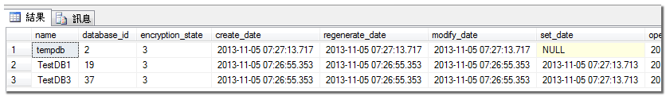
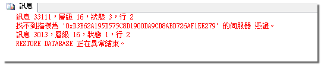

資料庫加密是指對儲存在資料庫中的數據進行加密，以保護數據在靜態和傳輸過程中的安全性。 這可以防止未經授權的訪問者讀取或使用數據。 資料庫加密有多種類型，包括檔案級加密、表級加密和欄位級加密。

SQL Server 提供下列加密機制：

- Transact-SQL functions
- Asymmetric keys
- Symmetric keys
- Certificates
- Transparent Data Encryption (透明資料加密)

# 透明資料加密 （Transparent Data Encryption, TDE）

透明資料加密（Transparent Data Encryption, TDE）， 這個功能是 SQL2008 才開始有的，它透過存在資料庫 boot record 中的資料庫密碼金鑰(DEK)，對整個資料庫的資料和記錄檔進行加密。 這個功能可以預防當實體資料庫不填被竊取後，遭附加或還原到其他執行個體而導至資料被瀏覽。

同時要注意的是，若執行個體中的任何一個資料庫啟用 TDE ，則系統資料庫 tempdb 也會同時被加密。

## 使用透明資料加密（Transparent Data Encryption, TDE）

若要使用 TDE，必須遵循下列步驟：

- 建立主要金鑰
- 建立憑證（使用主要金鑰保護）
- 建立資料庫加密金鑰（使用憑證保護）
- 設定資料庫使用 TDE

### 1. 建立主要金鑰
這個主要金鑰是一個對稱金鑰，提供下一步驟建立憑證用。
```SQL
USE [master];
GO
CREATE MASTER KEY ENCRYPTION BY PASSWORD = 'P@ssw0rd';
GO
```
PS. 在建立資料庫主要金鑰前，你可以使用 [sys.symmetric_keys](https://learn.microsoft.com/zh-tw/sql/relational-databases/system-catalog-views/sys-symmetric-keys-transact-sql?view=sql-server-ver17&redirectedfrom=MSDN) 檢視表查看資料庫中是否已經有建立金鑰。

### 2. 建立憑證
```SQL
USE [master];
GO
CREATE CERTIFICATE [MyCertificate]
	WITH SUBJECT = 'My TDE Certificate';
```
### 3. 建立資料庫加密金鑰
在使用「資料庫透明加密」功能之前，必須要擁有「資料庫加密金鑰（DEK）」，而這個步驟就是建立建立[資料庫加密金鑰](https://learn.microsoft.com/zh-tw/sql/t-sql/statements/create-database-encryption-key-transact-sql?view=sql-server-ver17)的主要步驟。
下列範例利用 AES_256 演算法建立一個資料庫加密金鑰。
```SQL
USE [TestDB1];
GO 

CREATE DATABASE ENCRYPTION KEY 
	WITH ALGORITHM = AES_256
	ENCRYPTION BY SERVER CERTIFICATE [MyCertificate]
GO 
```

### 4. 設定資料庫使用TDE
```SQL
ALTER DATABASE [TestDB1]
SET ENCRYPTION ON;
GO
```

<br>

若要檢視資料庫的加密狀態，可以使用 [sys.dm_database_encryption_keys](https://learn.microsoft.com/zh-tw/sql/relational-databases/system-dynamic-management-views/sys-dm-database-encryption-keys-transact-sql?view=sql-server-ver17&redirectedfrom=MSDN) 動態管理。

```SQL
select D.name, DEK.* 
from sys.dm_database_encryption_keys DEK
inner join sys.sysdatabases D on DEK.database_id=D.dbid
```


**encryption_state**
- 0 = 沒有資料庫加密金鑰存在
- 1 = 未加密
- 2 = 加密進行中
- 3 = 已加密
- 4 = 金鑰變更進行中
- 5 = 解密進行中
- 6 = 保護變更進行中

## 備份主要金鑰與憑證

### 1.備份主要金鑰
```SQL
USE master;

OPEN MASTER KEY DECRYPTION BY PASSWORD = 'P@ssw0rd';
BACKUP MASTER KEY TO FILE = N'D:\DbMasterKey' 
    ENCRYPTION BY PASSWORD = 'P@ssw0rd';
GO
```

### 2.備份憑證和私密金鑰
```SQL
USE [master];

BACKUP CERTIFICATE [MyCertificate] 
  TO FILE = N'D:\DbCertificate.cer'
    WITH PRIVATE KEY 
    (
      FILE = N'D:\DbPrivateKey.pvk',
      ENCRYPTION BY PASSWORD = 'P@ssw0rd'
    );
GO
```

## 還原 TDE 資料庫

如果，你在一部沒有憑證的SQL執行個體中，進行 TDE 資料庫的還原，這時候你會遇到以下錯誤。



這時你必須先匯入先前備份的主要金鑰和憑證才行，可參考以下步驟：

```SQL
--1) 載入主要金鑰
RESTORE MASTER KEY 
	FROM FILE = 'D:\DbMasterKey' 
    DECRYPTION BY PASSWORD = 'P@ssw0rd'
    ENCRYPTION BY PASSWORD = 'P@ssw0rd'

--2) 載入憑證
--再載入憑證前,必須先開啟主要金鑰
USE [master];

OPEN MASTER KEY DECRYPTION BY PASSWORD = 'P@ssw0rd'
ALTER MASTER KEY ADD ENCRYPTION BY SERVICE MASTER KEY

--從檔案建立憑證
CREATE CERTIFICATE [MyCertificate]
	FROM FILE = 'D:\DbCertificate.cer'
	WITH PRIVATE KEY (
        FILE = 'D:\DbPrivateKey.pvk', 
        DECRYPTION BY PASSWORD = 'P@ssw0rd'
    );

```

PS. 不同版本的資料庫，其匯出的憑證格式不盡相同，所以不同版本的資料庫憑證無法互通使用。

## 移除 TDE

要移除透明資料庫加密，大至和建立時的步驟相反。

```SQL
--停用資料庫加密
ALTER DATABASE testdb1
SET ENCRYPTION OFF;

--移除資料庫加密金鑰
use [testdb1]
DROP DATABASE ENCRYPTION KEY 

--卸除憑證
use [master]
DROP CERTIFICATE MyCertificate

--卸除主要金鑰
DROP MASTER KEY
```
