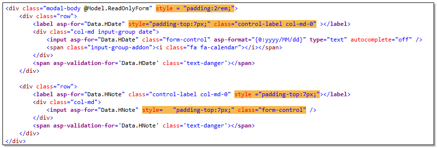
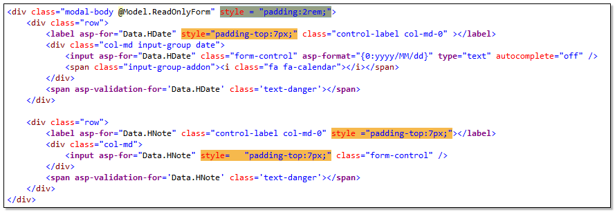
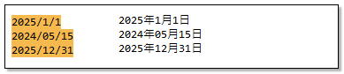
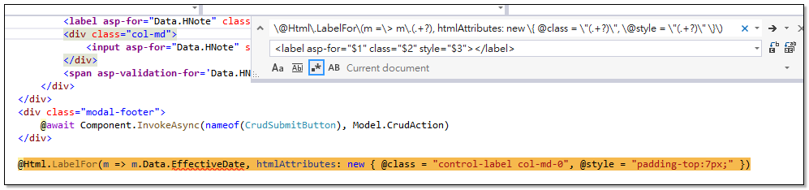

在使用 Visual Studio 編輯器的搜尋功能時，一般我們會透過文字模式進行比對，除此之外，更可以透過正規表達式比對模式，完成較複雜的搜尋條件。

使用 Regex 搜尋功能時，還可以使用「擷取群組」，取得目標字串中的子字串，然後使用 $1 $2 $3 ... 套用到取代模式中。


### 範例一
下面範例中，我們想要移除所有 html 標籤中的 style 屬性內容
```txt
Find：(style)\s*=\s*\"(.*)\"
Replace：
```

調整 Regex 搜尋式子，加上?，使用不貪心尋找，避免找到的範圍過大。
```txt
(style)\s*=\s*\"(.*?)\"
Replace：
```


## 範例二

下面例子中，可將 yyyy/mm/dd 的日期格式，取代成 yyyy年yy月dd日
```
Find：(\d{4})\/(\d{2})\/(\d{2})
Replace：$1年$2月$3日
```


### 範例三

下面程式碼是一行常見的 ASP.NET MVC 的 Html Helper 用法。
```html
@Html.LabelFor(m => m.Data.EffectiveDate, htmlAttributes: new { @class = "control-label col-md-0", @style = "padding-top:7px;" })
```
若我們想要改成 Tag Helper 寫法
```html
<label asp-for="Data.EffectiveDate" class="control-label col-md-0" style="padding-top:7px;"></label>
```
可以使用以下搜尋取代字串來進行處理。
```
Find：\@Html\.LabelFor\(m =\> m\.(.+?), htmlAttributes: new \{ @class = \"(.+?)\", \@style = \"(.+?)\" \}\)
Replace：<label asp-for="$1" class="$2" style="$3"></label>
```



