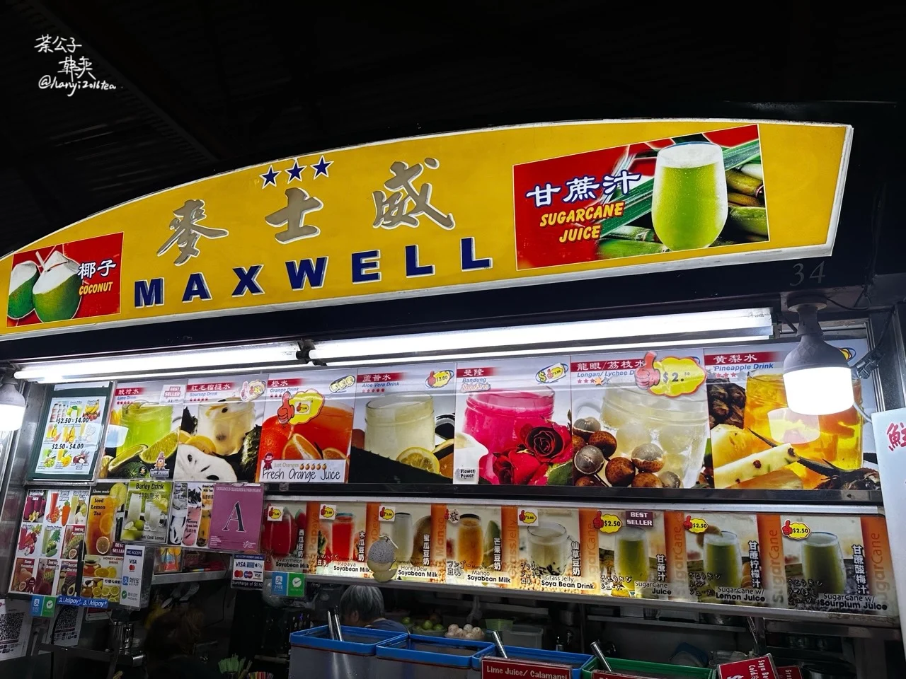
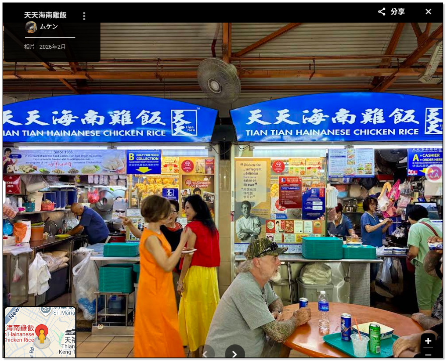

{: .warning-title}
>注意事項
>
>登機前72小時內，需上網填寫，<a href='https://eservices.ica.gov.sg/sgarrivalcard/' target='_blank'>新加坡電子入境卡(SG Arrival Card)</a> 。

## 機票

| 日期      | 起飛機場               | 抵達機場               | 航班         | 備註    |
| ------- | ------------------ | ------------------ | ---------- | ----- |
| 9/27(日) | 19:40 (LBJ) 下拉布安   | 23:05 (SIN) 新加坡 T1 | 酷航 TR291   | $7826 |
| 9/30(三) | 15:20 (SIN) 新加坡 T3 | 20:00 (TPE) 台北     | 長榮航空 BR216 | $6579 |

## 住宿

| 天數  | 日期      | 飯店                                                                                                                                                                                                                                                                                                                                                                                                                                           | 備註    |                         |
| --- | ------- | -------------------------------------------------------------------------------------------------------------------------------------------------------------------------------------------------------------------------------------------------------------------------------------------------------------------------------------------------------------------------------------------------------------------------------------------- | ----- | ----------------------- |
| D8  | 9/27(日) | <a target="_blank" href="https://www.google.com/maps/place/Hmlet+Essentials+Kallang/@1.311064,103.8712121,17z/data=!4m15!1m2!2m1!1sHmlet+Essention+Kallang!3m11!1s0x31da183420742105:0xe72057f7a7f664d3!5m3!1s2026-09-27!4m1!1i2!8m2!3d1.311064!4d103.873787!15sChdIbWxldCBFc3NlbnRpb24gS2FsbGFuZ5IBD3ZhY2F0aW9uX3JlbnRhbOABAA!16s%2Fg%2F11zh4wn87d!17BQ0FF?entry=ttu&g_ep=EgoyMDI2MDkwOS4wIKXMDSoASAFQAw%3D%3D">Hmlet Essention Kallang</a> | $6579 | 115 Geylang Road        |
| D9  | 9/28(一) | <a target="_blank" href="https://www.google.com/maps/place/Hmlet+Essentials+Kallang/@1.311064,103.8712121,17z/data=!4m15!1m2!2m1!1sHmlet+Essention+Kallang!3m11!1s0x31da183420742105:0xe72057f7a7f664d3!5m3!1s2026-09-27!4m1!1i2!8m2!3d1.311064!4d103.873787!15sChdIbWxldCBFc3NlbnRpb24gS2FsbGFuZ5IBD3ZhY2F0aW9uX3JlbnRhbOABAA!16s%2Fg%2F11zh4wn87d!17BQ0FF?entry=ttu&g_ep=EgoyMDI2MDkwOS4wIKXMDSoASAFQAw%3D%3D">Hmlet Essention Kallang</a> |       | +65 9478 5513           |
| D10 | 9/29(二) | <a target="_blank" href="https://www.google.com/maps/place/Hmlet+Essentials+Kallang/@1.311064,103.8712121,17z/data=!4m15!1m2!2m1!1sHmlet+Essention+Kallang!3m11!1s0x31da183420742105:0xe72057f7a7f664d3!5m3!1s2026-09-27!4m1!1i2!8m2!3d1.311064!4d103.873787!15sChdIbWxldCBFc3NlbnRpb24gS2FsbGFuZ5IBD3ZhY2F0aW9uX3JlbnRhbOABAA!16s%2Fg%2F11zh4wn87d!17BQ0FF?entry=ttu&g_ep=EgoyMDI2MDkwOS4wIKXMDSoASAFQAw%3D%3D">Hmlet Essention Kallang</a> |       | 06:00-11:00 15:00:23:00 |

## 預計行程

<a target="_blank" href="https://www.google.com/maps/d/u/0/edit?hl=zh-TW&mid=1bgEENYvtclfyxrIBhWOrXxxY00EvuX0&ll=1.293487137817333%2C103.85768631701663&z=15">Google 地圖</a>

{: .note-title}
>D1：9/28(一) 牛車水、魚尾獅、濱海公園、老巴剎

- 去程：EW10(Kallang) => EW12/DT14(Bugis) => DT19(Chinatown) 
- 回程：EW14(Raffles Place) => EW10

{: .note-title}
>D2：9/29(二) 小印度區、阿拉伯區、福康寧公園、克拉碼頭 }

- 去程：EW10(Kallang) => EW12/DT14(Bugis) => DT12(Little India) 
- 回程：EW13(City Hall) => EW10

## 行程景點

<table>
	<tr>
		<td>林志源肉乾</td>
		<td></td>
	</tr>
	<tr>
		<td>詹美回教堂</td>
		<td></td>
	</tr>
	<tr>
		<td>馬里安曼廟</td>
		<td></td>
	</tr>
	<tr>
		<td>佛牙寺龍華院</td>
		<td></td>
	</tr>
	<tr>
		<td>麥士威熟食中心</td>
		<td></td>
	</tr>
	<tr>
		<td>天天海南雞飯</td>
		<td></td>
	</tr>
	<tr>
		<td>天福宮</td>
		<td></td>
	</tr>
	<tr>
		<td>老巴剎</td>
		<td></td>
	</tr>
	<tr>
		<td>魚尾獅公園</td>
		<td></td>
	</tr>
	<tr>
		<td>濱海灣花園</td>
		<td></td>
	</tr>
	<tr>
		<td>老巴剎</td>
		<td></td>
	</tr>
</table>

<table>
	<th>
		<td>林志源肉乾</td>
		<td>詹美回教堂</td>
		<td>馬里安曼廟</td>
		<td>佛牙寺龍華院</td>
		<td>天天海南雞飯</td>
	</th>
</table>

